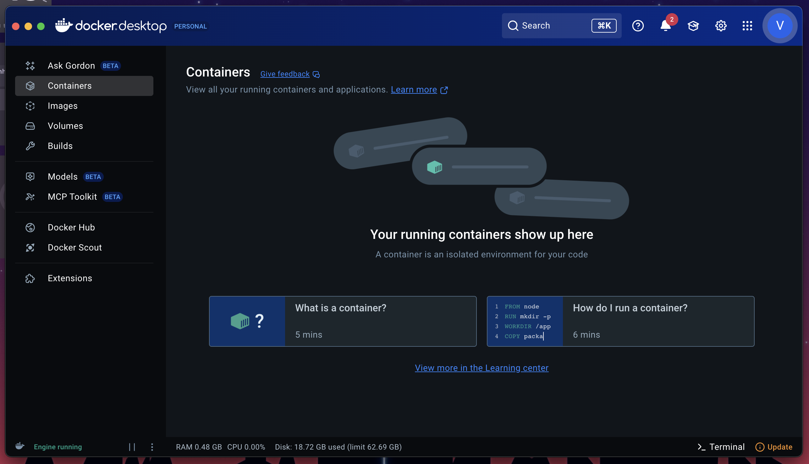
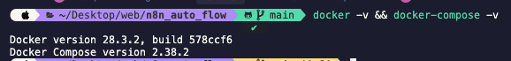

# Install Docker Desktop

## Prerequisites

Before setting up N8N, you need to install Docker Desktop on your system.

## Installation Steps

### 1. Download Docker Desktop

Download Docker Desktop from [here](https://www.docker.com/get-started/).

### 2. Install and Sign In

1. Install the Docker Desktop app
2. Sign in or sign up if you don't have a Docker account
3. After installation and login, Docker Desktop will look like this:

   

### 3. Verify Installation

Check that `docker` and `docker-compose` are active by running:

```shell
docker -v && docker-compose -v
```

If the installation is successful, the version check will look like this:



## Next Steps

Once Docker Desktop is installed and running, proceed to [Install VSCode](../02-vscode/01-install-vscode.md).
