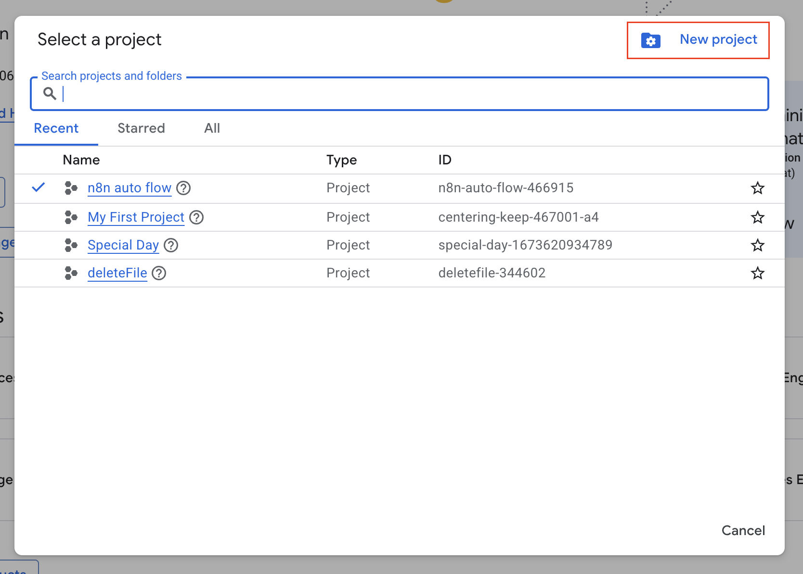
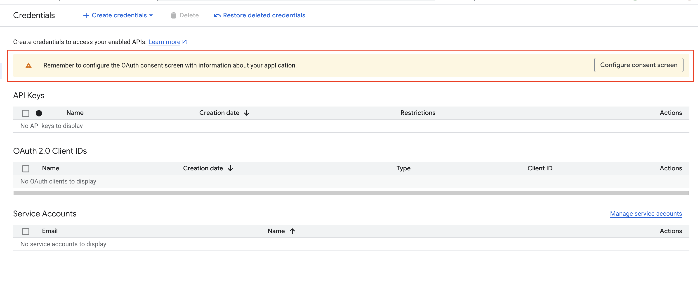
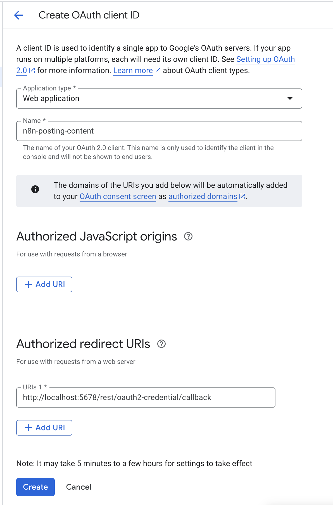

# Get Google API Access Token for N8N

## Overview

This guide provides step-by-step instructions for obtaining Google API access tokens that can be used in N8N workflows for services like Gmail, Google Sheets, Google Drive, and Google Calendar.

## Prerequisites

Before starting, ensure you have:

- A Google account
- Basic understanding of API authentication concepts

## Step 1: Create a Google Cloud Project

1. Go to [Google Cloud Console](https://console.cloud.google.com/)
   
2. In modal opened click → "New Project"
   
3. Enter a project name (e.g., "N8N Integration")
4. Click "Create"

## Step 2: Enable Required APIs

1. In your project, go to "APIs & Services" → "Library"
2. Search and enable the APIs you need:
   - **Google Sheets API** - For spreadsheet operations
   - **Google Drive API** - For file management

### To enable an API:

1. Search for the API name in the library
2. Click on the API
3. Click "Enable"

## Step 3: Create OAuth 2.0 Credentials

1. Go to "APIs & Services" → "Credentials"
2. Note if you got this message:
   `Remember to configure the OAuth consent screen with information about your application.`
   
   => Please click to `Config consent screen` to create an config before execute the next step. After create the config successfully click [here](https://console.cloud.google.com/apis/credentials) to redirect again to Credentials page.
3. Click "Create Credentials" → "OAuth 2.0 Client IDs"
   
4. Enter form follow this guide
   - Application type: `Web application`
   - Name: `n8n-posting-content`
   - Authorized redirect URIs: `http://localhost:5678/rest/oauth2-credential/callback`
     
     then click `Create` button.
5. After create you will got the modal opened with the info of `Client ID` and `Client secret`. To reuse this credentials info later, please click to `Download JSON` tobe save the credentials file.

## Step 4: Add the test users to allow access Google API

1. Access to [Google Audience](https://console.cloud.google.com/auth/audience)
2. Make sure the `Test users` table already has at least 1 user (preferably the email address you are logging in with)
3. If not, click the button `Add users` to add new one.

## Next Steps

Once you have successfully configured Google API access:

**Proceed to Next Platform**: Continue with [LinkedIn API Setup](./02-get-access-token-for-linkedin.md)

## Additional Resources

- [Google OAuth 2.0 Documentation](https://developers.google.com/identity/protocols/oauth2)
- [Google APIs Explorer](https://developers.google.com/apis-explorer/)
- [N8N Google Integrations](https://docs.n8n.io/integrations/nodes/n8n-nodes-base.google/)
- [Google Cloud Console](https://console.cloud.google.com/)
