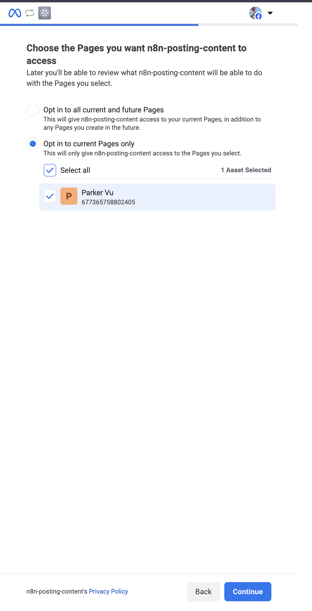

# Get Facebook API Access Token for N8N

## Overview

This guide provides step-by-step instructions for obtaining Facebook API access tokens that can be used in N8N workflows for Facebook marketing, social media automation, and business page management.

## Prerequisites

Before starting, ensure you have:

- A Facebook account
- A Facebook Business Page
- Basic understanding of API authentication concepts

## Step 1: Create a Facebook App

1. Go to [Facebook Developers Apps](https://developers.facebook.com/apps/)
2. Click "Create App"
3. In `Add use cases`, choose the app type **Other** → **Business**
4. Click "Create App"
5. After creating the app, in the dashboard of the app, find and set up the product called `Facebook Login for Business`, then click `Set up`

## Step 2: Configure App Settings

1. In your app dashboard, go to "App Settings" → "Basic"
2. Note down your credentials:
   - **App ID**: Your app's unique identifier
   - **App Secret**: Your app's secret key (keep this secure)
3. Enter the field "Privacy Policy URL":
   - You can simply use this URL: `https://www.notion.so/Privacy-Policy-23bcdfbb0c61807fadd7f76ba4ef59fe`
   - Or you can create a new one yourself using [Notion](https://www.notion.so) to create a new document with the same content as the URL above. Then set the permission as `Anyone via link`.
4. Click "Save Changes"

## Step 3: Set app mode to `Live`

- Click the toggle button in the picture
  

## Step 4: Generate Access Token

1. From the menu bar, click "Tool" → "Graph API Explorer"
   
2. In "Meta App", select your app.
3. In "User or Page", select "Get Page Access Token"

- You need to be logged in with your Facebook account, then choose the page you want to access like this:
  
- Then click "Save"

4. Add the "Permissions" for the access token following this:

```
pages_show_list
business_management
attribution_read
page_events
pages_read_engagement
pages_manage_posts
```

5. Click "Generate Access Token", then click the button "Copy" to copy your access token
   

## Step 5: Extend access token expiry for longer

1. From "Tool" → Select "Access token debugger"
   
2. Paste your token that you copied into the input field, then click the button "Debug"
3. Scroll to the end and you will see the button "Extend Access Token", click it.
4. You will get a new access token with green color, copy and save it to use later

## Next Steps

Proceed to [N8N Workflow](../05-workflows/01-create-n8n-workflow.md).

## Additional Resources

- [Facebook Graph API Documentation](https://developers.facebook.com/docs/graph-api)
- [Facebook OAuth 2.0 Guide](https://developers.facebook.com/docs/facebook-login/security)
- [N8N Facebook Integrations](https://docs.n8n.io/integrations/nodes/n8n-nodes-base.facebook/)
- [Facebook Developers Portal](https://developers.facebook.com/)
- [Graph API Explorer](https://developers.facebook.com/tools/explorer/)
