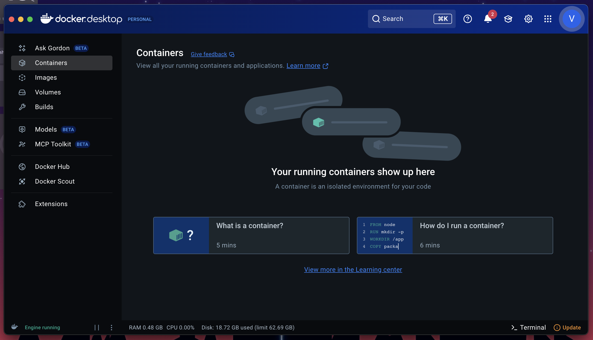

# Step 1: Install Docker Desktop

## 🎯 What is Docker Desktop and Why Do You Need It?

**Docker Desktop** is a tool that helps run N8N on your computer. Think of it like a container that safely runs the automation software without affecting your other programs.

### ✅ What You'll Get

- A safe environment to run N8N
- No conflicts with your existing software
- Easy setup and management

## 🛠️ What You Need Before Starting

- **A computer** (Windows, Mac, or Linux)
- **Internet connection** to download the software
- **Basic computer skills** (clicking, downloading, installing)

## 📥 Step-by-Step Installation

### Step 1: Download Docker Desktop

1. **Open your web browser** (Chrome, Firefox, Safari, or Edge)
2. **Go to the Docker website**: [Click here to visit Docker](https://www.docker.com/get-started/)
3. **Look for the download button** - it's usually big and blue
4. **Click "Download for [Your Operating System]"** - Docker will automatically detect your computer type

### Step 2: Install Docker Desktop

1. **Find the downloaded file** - Usually in your Downloads folder
2. **Double-click the file** to start installation
3. **Follow the installation wizard**:
   - Click "Next" when prompted
   - Accept the license agreement
   - Choose the default installation location
   - Click "Install"
4. **Wait for installation to complete** - This may take a few minutes
5. **Click "Finish"** when done

### Step 3: Start Docker Desktop

1. **Look for Docker Desktop** in your computer's menu/start menu
2. **Click to open Docker Desktop**
3. **Wait for it to start** - You'll see a Docker icon in your system tray
4. **Sign in or create an account**:
   - If you have a Docker account, sign in
   - If not, click "Sign up" to create a free account
   - This step is optional but recommended

### Step 4: Verify Everything is Working

1. **Open Docker Desktop** if it's not already open
2. **Look for a green status** - This means Docker is running properly
3. **You should see something like this**:

   

## ✅ How to Check if Installation Worked

### For Windows Users:

1. **Press Windows key + R**
2. **Type "cmd" and press Enter**
3. **Type this command**: `docker --version`
4. **Press Enter** - You should see version information

### For Mac Users:

1. **Open Terminal** (use Spotlight search for "Terminal")
2. **Type this command**: `docker --version`
3. **Press Enter** - You should see version information

### For Linux Users:

1. **Open Terminal**
2. **Type this command**: `docker --version`
3. **Press Enter** - You should see version information

**Expected result** (don't worry about the exact numbers):

```
Docker version 20.10.x, build xxxxxxx
```

If you see something like this, congratulations! Docker is working properly.

## 🚨 Troubleshooting

### Docker Won't Start?

- **Restart your computer** and try again
- **Check if your computer meets the requirements**:
  - Windows 10/11 Pro, Enterprise, or Education
  - Mac: macOS 10.15 or newer
  - Linux: Ubuntu 18.04+ or similar

### Installation Failed?

- **Try downloading again** from the official website
- **Disable antivirus temporarily** during installation
- **Run as administrator** (Windows users)

### Still Having Issues?

- **Check Docker's official troubleshooting guide**: [Docker Desktop Troubleshooting](https://docs.docker.com/desktop/troubleshoot/)
- **Ask for help** in the N8N community forums

## 🎉 You're Ready for the Next Step!

Once Docker Desktop is running (you see the green status), you're ready to move on to the next step.

**Next**: [Install VSCode](../02-vscode/01-install-vscode.md) - This will help you manage your automation workspace.

---

_💡 **Tip**: Keep Docker Desktop running in the background. You'll need it for the next steps._
