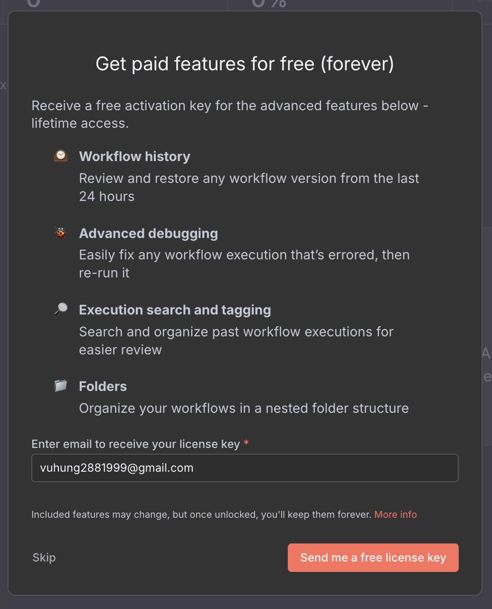

# Step 3: Set Up N8N - Your Automation Workspace

## 🎯 What is N8N and What Are We Setting Up?

**N8N** is your automation workspace - think of it as a digital workshop where you can create automated workflows. It's like having a smart assistant that can automatically post to social media, send emails, and manage your content.

### ✅ What You'll Have After This Step

- Your own N8N workspace running on your computer
- A web interface to create automations
- The foundation to connect your social media accounts

## 🛠️ What You Need Before Starting

Make sure you've completed these steps first:

- ✅ [Docker Desktop installed](../01-setup/01-docker-desktop.md)
- ✅ [VSCode installed](../02-vscode/01-install-vscode.md)
- ✅ Docker Desktop is running (green status)

## 📥 Step-by-Step Setup

### Step 1: Get the Project Files

You have two options to download the project files:

#### Option A: Easy Download (Recommended for Beginners)

1. **Open your web browser**
2. **Go to this link**: [N8N Tutorial Project](https://github.com/HRLitgroup/n8n-posting-content-tutorial.git)
3. **Look for the green "Code" button** (usually in the top right)
4. **Click the "Code" button**
5. **Click "Download ZIP"**
6. **Wait for the download to complete**
7. **Find the ZIP file** in your Downloads folder
8. **Right-click the ZIP file** and select "Extract All" or "Extract Here"
9. **Choose a location** (like your Desktop) and click "Extract"

You should now have a folder called `n8n-posting-content-tutorial` on your computer.


#### Option B: Using Git (For Experienced Users)

If you're familiar with Git, you can use this method:

1. **Open Terminal/Command Prompt**
2. **Navigate to where you want the project**
3. **Run this command**:
   ```bash
   git clone https://github.com/HRLitgroup/n8n-posting-content-tutorial.git
   ```

### Step 2: Open the Project in VSCode

1. **Open VSCode** (the blue icon)
2. **Go to File menu** → **Open Folder**
3. **Navigate to the folder** you extracted in Step 1
4. **Select the folder** and click "Select Folder"
5. **You should see the project files** in the left sidebar

### Step 3: Start N8N (The Easy Way)

1. **In VSCode, press `Ctrl + J`** (Windows/Linux) or `Cmd + J` (Mac)
   - This opens the terminal at the bottom of VSCode
2. **Type this command** and press Enter:
   ```bash
   docker-compose up -d
   ```
3. **Wait for it to finish** - You'll see some text scrolling
4. **When it's done**, you should see a message like "Done"

### Step 4: Access Your N8N Workspace

1. **Open your web browser**
2. **Go to**: [http://localhost:5678](http://localhost:5678)
3. **You should see the N8N welcome screen**

If you see the N8N interface, congratulations! Your automation workspace is running.

### Step 5: Create Your N8N Account

1. **On the N8N welcome screen**, click "Get Started"
2. **Fill in your details**:
   - **Email**: Your email address
   - **Password**: Choose a strong password
   - **Name**: Your name
3. **Click "Create Account"**


4. **Choose the free option**: Select "Send me a free license key"
5. **Click "Continue"**



### Step 6: Activate Your Account

1. **Check your email** for a message from N8N
2. **Click the activation link** in the email
3. **Or copy the license key** and paste it in N8N
4. **Click "Activate License"**


### Step 7: You're Ready!

After activation, you'll see your N8N dashboard. This is your automation workspace where you can:

- Create workflows
- Connect your social media accounts
- Set up automated tasks

## 🚨 Troubleshooting

### Can't Access N8N at localhost:5678?

1. **Make sure Docker Desktop is running** (green status)
2. **Check if the command finished** in VSCode terminal
3. **Try refreshing the browser page**
4. **If still not working**:
   - Close VSCode
   - Restart Docker Desktop
   - Open VSCode again
   - Run the command again

### Docker Command Failed?

1. **Make sure you're in the right folder** in VSCode
2. **Check that Docker Desktop is running**
3. **Try running the command again**
4. **If you see errors**, try:
   ```bash
   docker-compose down
   docker-compose up -d
   ```

### Account Creation Issues?

- **Use a valid email address**
- **Choose a strong password** (8+ characters)
- **Check your spam folder** for the activation email
- **Try a different browser** if the page doesn't load

## 🎉 Success! What's Next?

You now have:

- ✅ N8N running on your computer
- ✅ Your own automation workspace
- ✅ A web interface to create workflows

**Next Step**: [Connect Your Social Media Accounts](../04-authentication/get-access-token.md) - This is where the fun begins! You'll learn how to connect your Google, LinkedIn, and Facebook accounts to start automating your content posting.

---

_💡 **Tip**: Keep N8N running in your browser. You'll be using it a lot in the next steps!_
