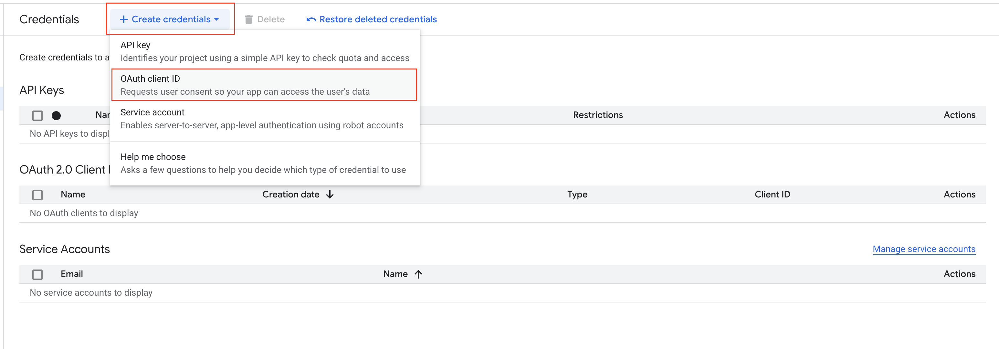

# Connect Google Services to N8N

## 🎯 What Are We Setting Up?

**Google Services** include Gmail, Google Sheets, Google Drive, and Google Calendar. By connecting these to N8N, you can automate email sending, update spreadsheets, save files, and manage calendar events automatically.

### ✅ What You'll Get

- Ability to send emails automatically from Gmail
- Update Google Sheets with new data
- Save files to Google Drive automatically
- Manage Google Calendar events
- All your Google services working together

## 🛠️ What You Need Before Starting

Make sure you have:

- ✅ A Google account (Gmail, Google Workspace, or personal)
- ✅ About 15-20 minutes to complete the setup
- ✅ Your Google password ready (you'll need to log in)

## 📋 Step-by-Step Setup

### Step 1: Create Your Google Cloud Project

Think of this as creating a workspace for your automation:

1. **Open your web browser**
2. **Go to Google Cloud Console**: [Click here to visit](https://console.cloud.google.com/)
3. **Sign in with your Google account** if prompted
4. **Look for the project dropdown** at the top of the page
5. **Click "New Project"** or the "+" button

6. **Enter a project name** (e.g., "My N8N Automation")
7. **Click "Create"**

### Step 2: Enable the Services You Need

Now we'll turn on the Google services you want to automate:

1. **In your new project**, look for "APIs & Services" in the left menu
2. **Click "Library"**
3. **Search for each service** you want to use:

#### For Email Automation:

- Search for "Gmail API"
- Click on it and press "Enable"

#### For Spreadsheet Automation:

- Search for "Google Sheets API"
- Click on it and press "Enable"

#### For File Management:

- Search for "Google Drive API"
- Click on it and press "Enable"

### Step 3: Set Up Security (OAuth Consent Screen)

This step tells Google that your automation is safe:

1. **Go to "APIs & Services"** → **"OAuth consent screen"**
2. **Choose "External"** (unless you have a Google Workspace account)
3. **Click "Create"**
4. **Fill in the required information**:
   - **App name**: "My N8N Automation"
   - **User support email**: Your email address
   - **Developer contact information**: Your email address
5. **Click "Save and Continue"**
6. **Skip the next sections** (Scopes, Test users) for now
7. **Click "Save and Continue"** until you're done

### Step 4: Create Your Access Keys

This creates the "keys" that N8N will use to access your Google services:

1. **Go to "APIs & Services"** → **"Credentials"**
2. **Click "Create Credentials"** → **"OAuth 2.0 Client IDs"**

3. **Fill in the form**:
   - **Application type**: Choose "Web application"
   - **Name**: "N8N Google Integration"
   - **Authorized redirect URIs**: Add `http://localhost:5678/rest/oauth2-credential/callback`

4. **Click "Create"**
5. **A popup will appear** with your Client ID and Client Secret
6. **Click "Download JSON"** to save these credentials safely

### Step 5: Add Yourself as a Test User

This allows your Google account to use the automation:

1. **Go back to "OAuth consent screen"**
2. **Click "Add Users"** in the Test users section
3. **Add your email address** (the one you use for Google)
4. **Click "Save"**

## ✅ How to Check if Setup Worked

1. **You should have downloaded a JSON file** with your credentials
2. **Your email should be listed** in the Test users section
3. **The APIs should show as "Enabled"** in the Library

## 🚨 Troubleshooting

### Can't Find the APIs?

- **Make sure you're in the right project** (check the project name at the top)
- **Try searching again** with the exact names: "Gmail API", "Google Sheets API"

### OAuth Consent Screen Issues?

- **Make sure you filled in all required fields** (marked with \*)
- **Try refreshing the page** and starting over
- **Check that you chose "External"** user type

### Credentials Not Working?

- **Make sure you downloaded the JSON file**
- **Check that your email is in Test users**
- **Verify the redirect URI is exactly**: `http://localhost:5678/rest/oauth2-credential/callback`

### Still Having Problems?

- **Try creating a new project** and starting over
- **Check that you're signed in** with the right Google account
- **Make sure you have admin access** to your Google account

## 🎉 You're Ready for the Next Step!

Once you have your Google credentials set up, you can:

1. **Connect LinkedIn**: [Set up LinkedIn automation](./02-get-access-token-for-linkedin.md)
2. **Connect Facebook**: [Set up Facebook automation](./03-get-access-token-for-facebook.md)
3. **Start creating workflows**: Use your Google services in N8N

## 📚 Additional Resources

- **Need help?** Check [Google's OAuth documentation](https://developers.google.com/identity/protocols/oauth2)
- **Want to explore?** Try [Google APIs Explorer](https://developers.google.com/apis-explorer/)
- **N8N specific help**: [N8N Google integrations guide](https://docs.n8n.io/integrations/nodes/n8n-nodes-base.google/)

---

_💡 **Tip**: Keep your downloaded JSON file safe. You'll need it when connecting to N8N later._
