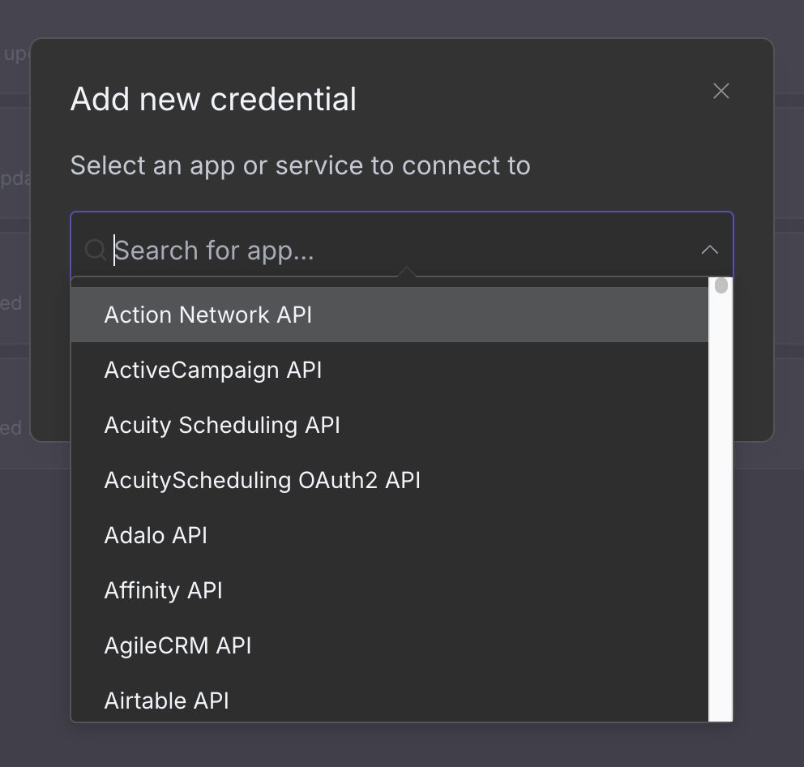
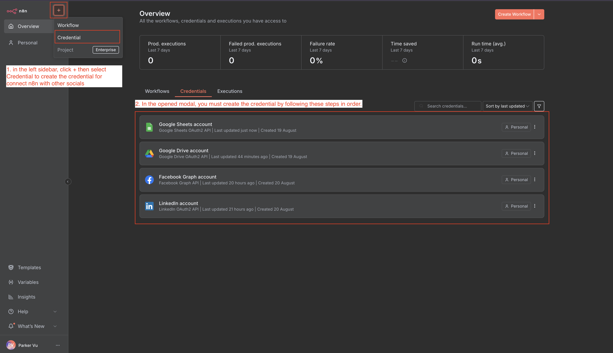
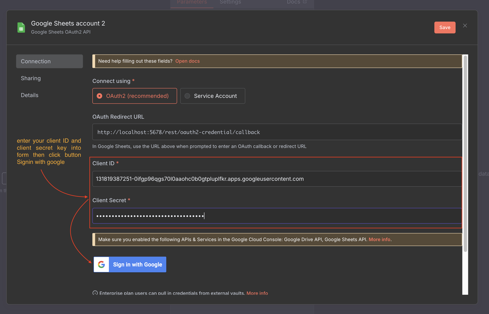
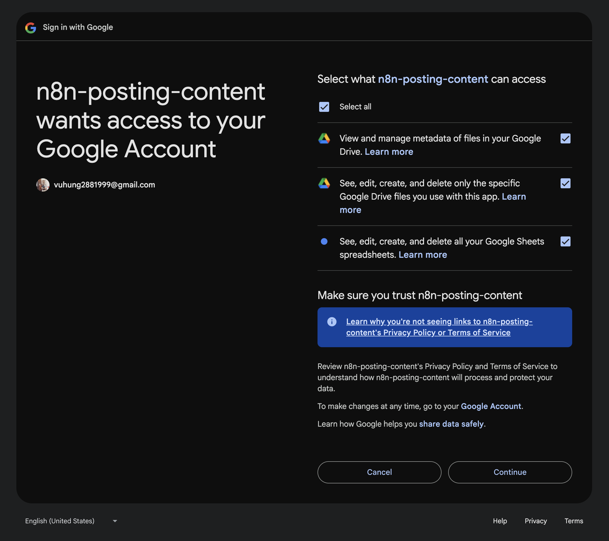
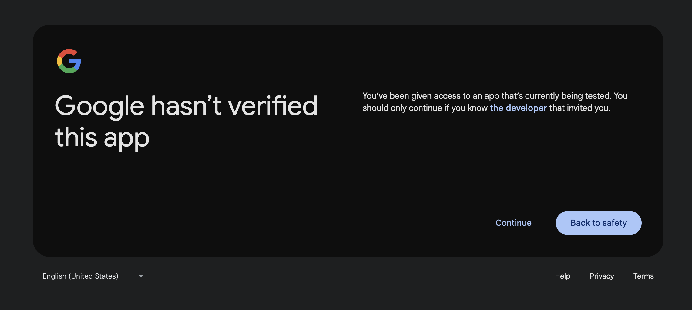
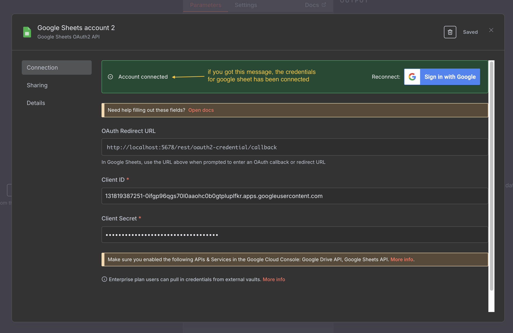
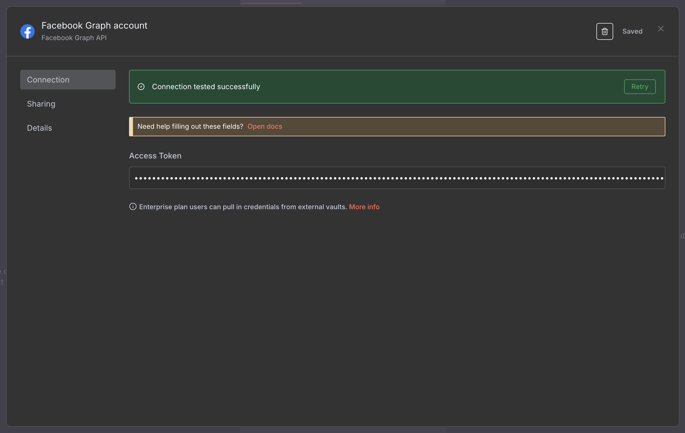
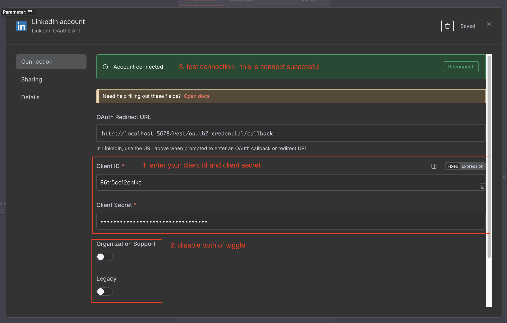

# Create Credentials to Connect n8n with Social Media Platforms

## How to Create Credentials in n8n

1. In the left sidebar, click the **+** button, then select **Credential** - a modal will appear
   

2. You must create credentials in the following order:

| Order | Platform               | Purpose                    |
| ----- | ---------------------- | -------------------------- |
| 1     | Google Sheets account  | Access to spreadsheet data |
| 2     | Google Drive account   | Access to image files      |
| 3     | Facebook Graph account | Post to Facebook           |
| 4     | LinkedIn account       | Post to LinkedIn           |

## Google Sheets Account and Google Drive Account

Both Google Sheets and Google Drive use the same credential creation process. This tutorial demonstrates the Google Sheets setup.

### Step 1: Enter Credentials

Fill in your **Client ID** and **Client Secret**, then click **Sign in with Google**

### Step 2: Grant Permissions

The browser will redirect you to the Google login portal. Select your Google account, then you'll be redirected to the permissions page. Click **Select All** to grant all permissions for accessing Google Sheets and Google Drive, then click **Continue**

### Step 3: Handle Warning

You may see a warning message - don't worry, just click **Continue**

### Step 4: Verification Complete

After verification, you'll see a green success message like this. (Repeat the same process for Google Drive)

## Facebook Graph Account

## LinkedIn Account

---

**Previous**: [Create Sheet](./01-create-sheet.md)  
**Next**: [Create Workflow](./03-create-workflow.md)
