# Creating a Workflow for n8n

## Overview

Before we begin, let's look at the workflow overview to understand its structure and appearance.

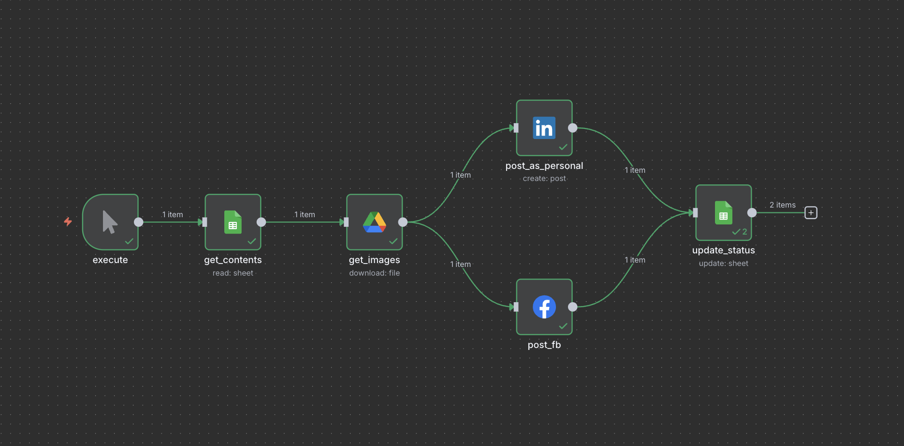

**Note**: If you want to get started quickly, you can reuse [my workflow](../../../exports/N8N%20Auto%20Posting%20Content.json)

- Download the JSON file and import it into n8n
- Update the credentials with your account information (follow the [previous document](../05-workflows/02-create-credentials.md))
- That's it! Your n8n auto-posting content workflow is ready to execute.

## Workflow Steps Overview

| Step | Action                 | Purpose                                      | Platform           |
| ---- | ---------------------- | -------------------------------------------- | ------------------ |
| 1    | Create Workflow        | Initialize new workflow project              | n8n                |
| 2    | Manual Trigger         | Start workflow execution                     | n8n                |
| 3    | Get Google Sheets Data | Retrieve content with 'ready' status         | Google Sheets      |
| 4    | Download Images        | Convert image URLs to binary format          | Google Drive       |
| 5    | Post to LinkedIn       | Share content on LinkedIn                    | LinkedIn           |
| 6    | Post to Facebook       | Share content on Facebook                    | Facebook Graph API |
| 7    | Update Sheet Status    | Mark content as posted and increment counter | Google Sheets      |

## Step 1

On the home page, click on 'Create Workflow'.
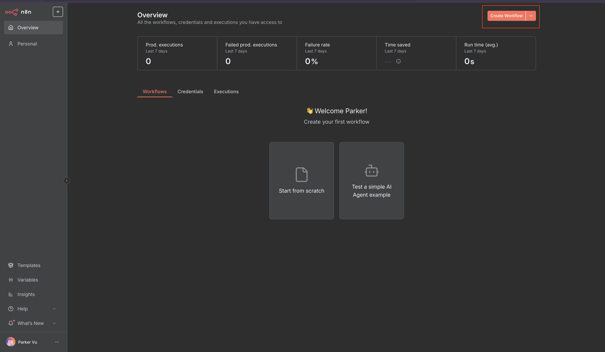

Next, set the project name to 'N8N Auto Posting Content' and click Save.
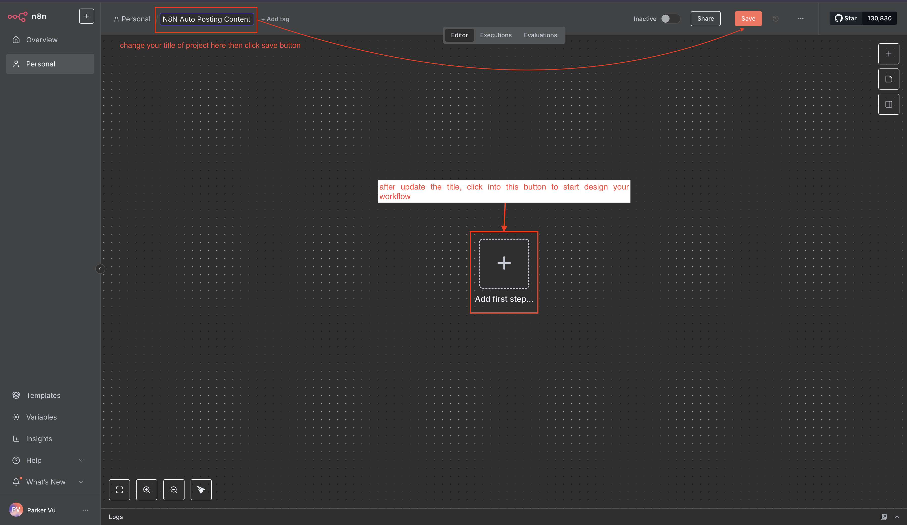

Then, click on the 'Add first step...' button.

## Step 2

We will use the Manual trigger node, which means n8n will run the workflow when we click on 'Execute Workflow'.

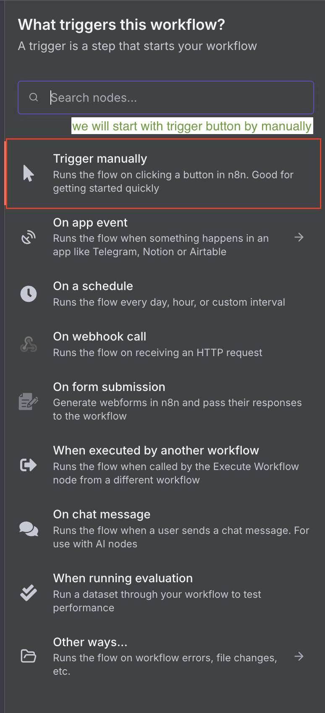

## Step 3

Click on the + button, search for 'Google Sheets', and select it.
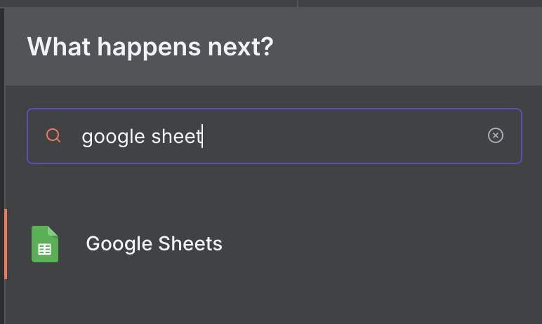

We will use the 'Get row(s) in sheet' action to retrieve all content with a status of 'ready'.
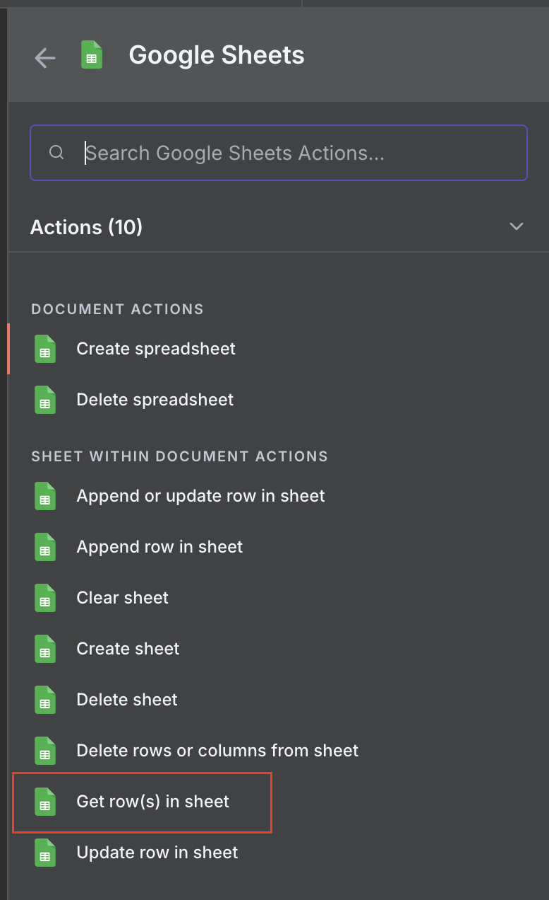

Follow the guide below (remember to connect this node with the trigger node from Step 2):

1. Choose your Google Sheets credential connection
2. Select your document (n8n_contents) and sheet index (Sheet1)
3. Add filters to get records with status 'ready':
   - Choose column: status
   - Set value to: 'ready'
4. Click on 'Execute Step'
5. The success or failure result will appear on the right side
   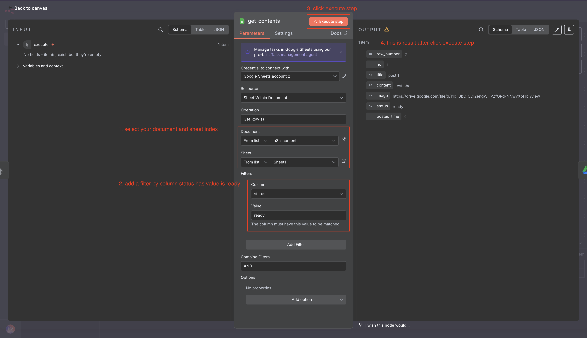

## Step 4

Click on the + button, search for 'Google Drive', and select it.
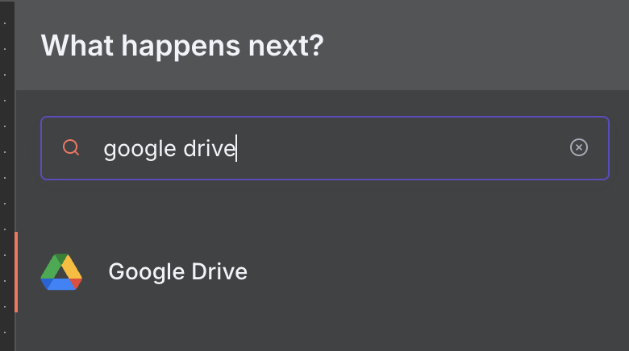

We will use the 'Download file' action to convert images from URLs to binary format, as social media platforms only accept images in binary format.
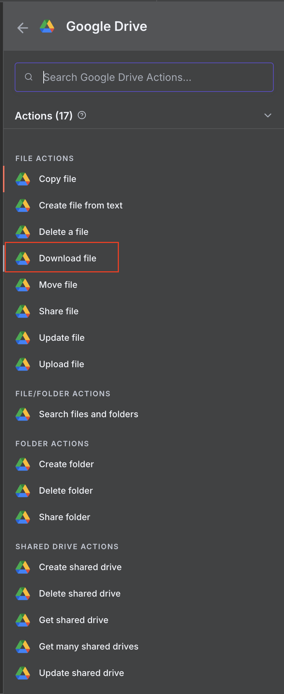

Follow the guide below (remember to connect this node with the Google Sheets node from Step 3):

1. Choose your Google Drive credential connection
2. In the File field, change the dropdown on the left to 'By URL'
3. Drag and drop the 'image' field into the File value field on the right (see image for details)
4. Click on 'Execute Step'
5. The success or failure result will appear on the right side
   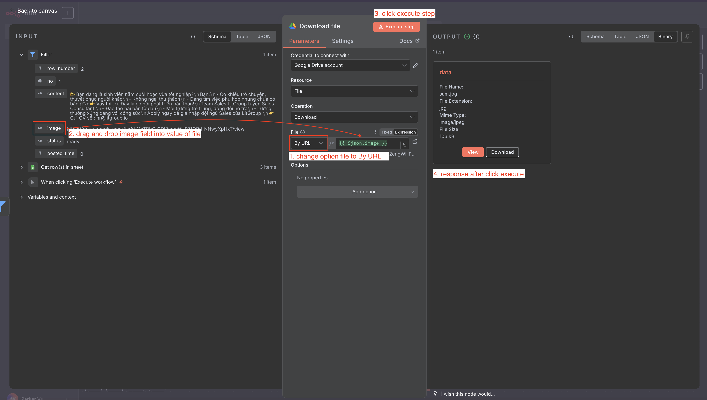

## Step 5

Click on the + button, search for 'LinkedIn', and select it.
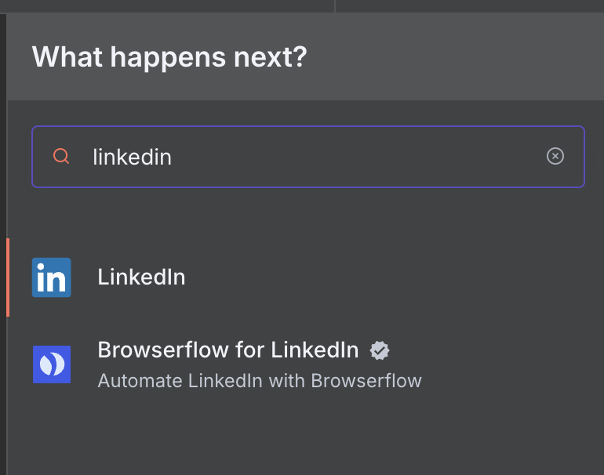

Choose the 'Create a post' action.
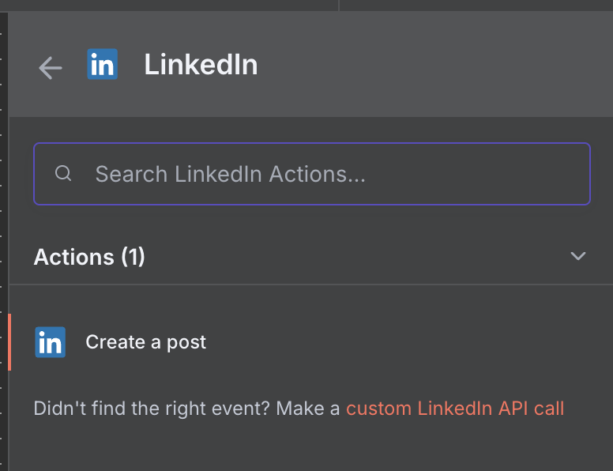

Follow the guide below (remember to connect this node with the Google Drive node from Step 4):

1. Choose your 'LinkedIn account' credential connection
2. From the top left, change the current tab to 'Schema'
3. Drag and drop the 'content' field into the Text value field in the center (see image for details)
4. In the 'Input Binary Field', enter the value: 'data'
5. Click on 'Execute Step'
6. The success or failure result will appear on the right side
   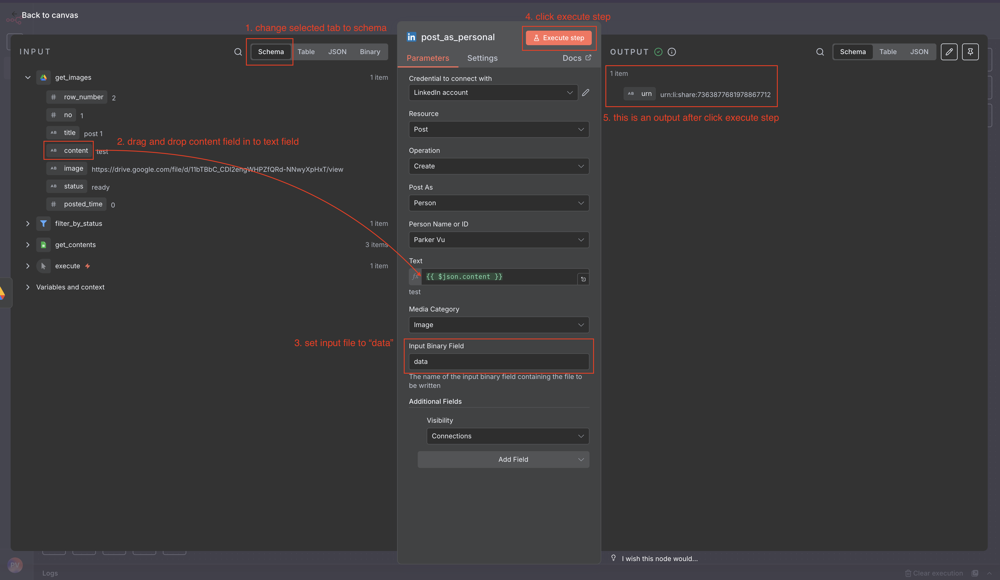

## Step 6

Click on the + button, search for 'Facebook Graph API', and select it.
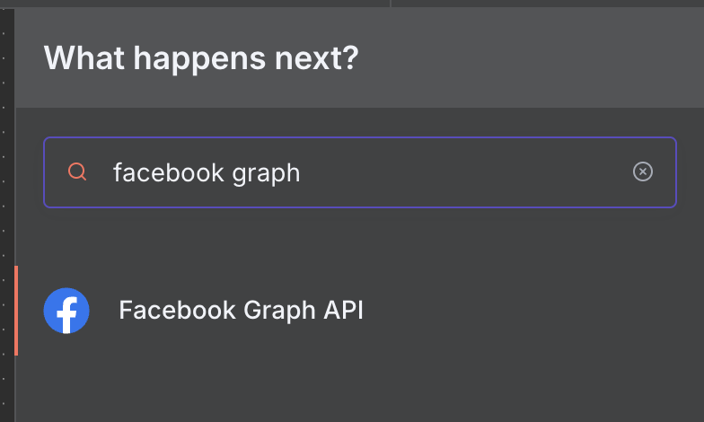

Follow the guide below (remember to connect this node with the Google Drive node from Step 4):

1. Choose your 'Facebook Graph account' credential connection
2. From the top left, change the current tab to 'Schema'
3. Configure the fields:
   - HTTP Request Method: POST (used to create a request for posting new messages to the Facebook API)
   - Graph API Version: Choose the latest version (currently v23.0)
   - Node: me
   - Edge: photos (used for posting new messages with images)
4. Enable 'Send Binary File' and set the Input Binary Field to 'data'
5. In Options, create a new Query Parameter with:
   - Name: message
   - Value: Drag and drop the 'content' field into the Value field (see image for details)
6. Click on 'Execute Step'
7. The success or failure result will appear on the right side
   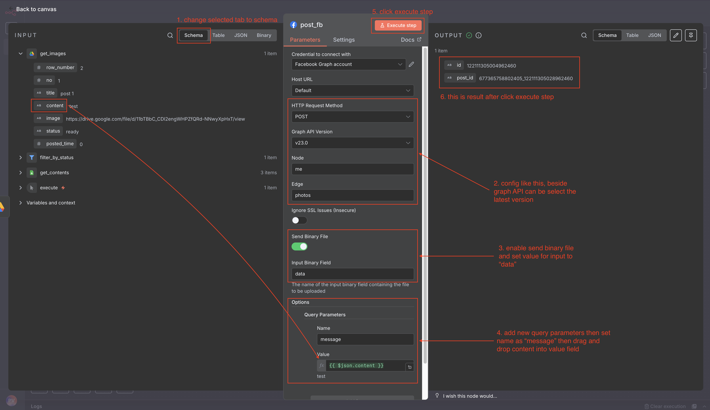

## Step 7

Click on the + button, search for 'Google Sheets', and select it.
We will use the 'Update row in sheet' action to update the status to 'posted' and increment the posted_time by 1.
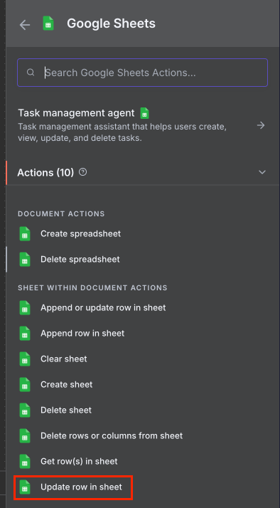

Follow the guide below (remember to connect this node with both the LinkedIn and Facebook nodes from Steps 5 & 6):

1. Choose your 'Google Sheets account' credential connection
2. Configure the fields:
   - Resource: Sheet Within Document
   - Operation: Update Row
   - Document and Sheet: Select your document (n8n_contents) and sheet index (Sheet1)
   - Mapping Column Mode: Map Each Column Manually
   - Column to match on: Select field 'no'
3. In the 'Value to Update' field:
   - Drag and drop the 'no' field into the **no (using to match)** field
     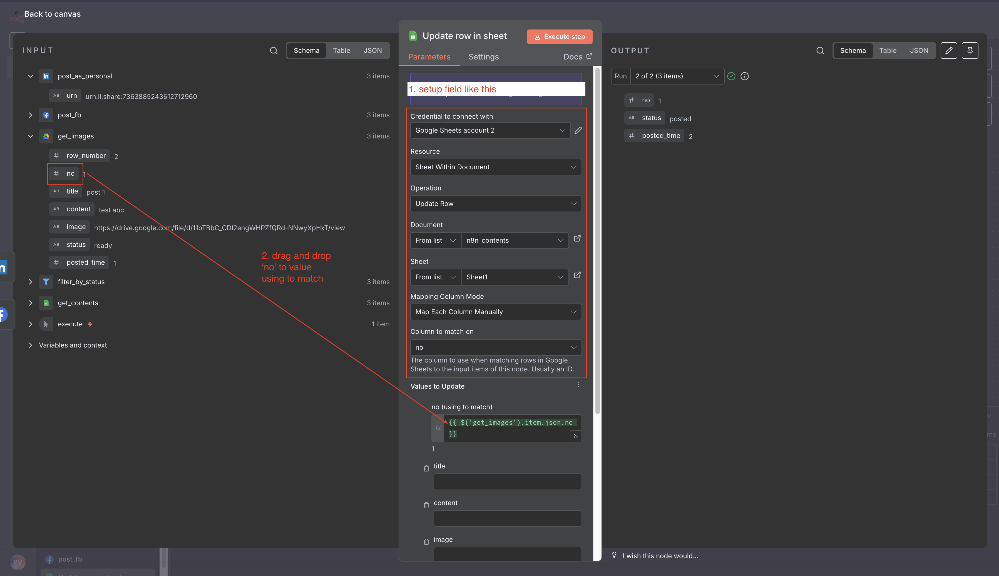
   - In the status field, set the value to 'posted'
   - In the posted_time field, drag and drop 'posted_time' into the value of posted_time in the center (see image for details), then add `+ 1` before the end of `}}`
     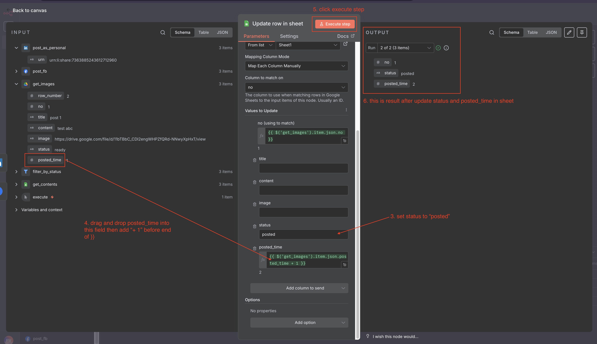
4. Click on 'Execute Step'
5. The success or failure result will appear on the right side

---

**Previous**: [Create Credentials](./02-create-credentials.md)  
**Next**: [Back to Workflows Overview](./n8n-workflow.md)
