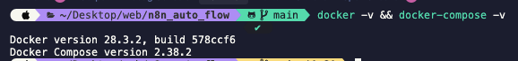

# Cài đặt Docker Desktop

## Yêu Cầu Trước Khi Bắt Đầu

Trước khi thiết lập N8N, bạn cần cài đặt Docker Desktop trên hệ thống của mình.

## Các Bước Cài Đặt

### 1. Tải Docker Desktop

Tải Docker Desktop từ [đây](https://www.docker.com/get-started/).

### 2. Cài Đặt và Đăng Nhập

1. Cài đặt ứng dụng Docker Desktop
2. Đăng nhập hoặc đăng ký nếu bạn chưa có tài khoản Docker
3. Sau khi cài đặt và đăng nhập, Docker Desktop sẽ trông như thế này:

   

### 3. Xác Minh Cài Đặt

Kiểm tra rằng `docker` và `docker-compose` đang hoạt động bằng cách chạy:

```shell
docker -v && docker-compose -v
```

Nếu cài đặt thành công, việc kiểm tra phiên bản sẽ trông như thế này:



## Bước Tiếp Theo

Sau khi Docker Desktop được cài đặt và chạy, tiếp tục với [Cài đặt VSCode](../02-vscode/01-install-vscode.vi.md).
