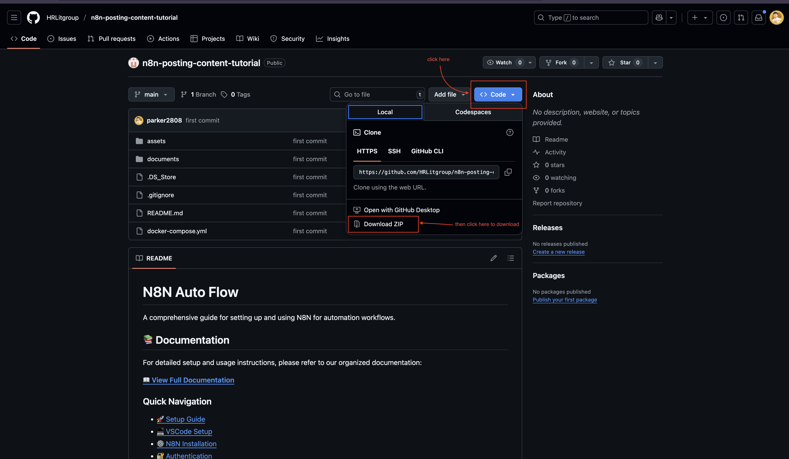
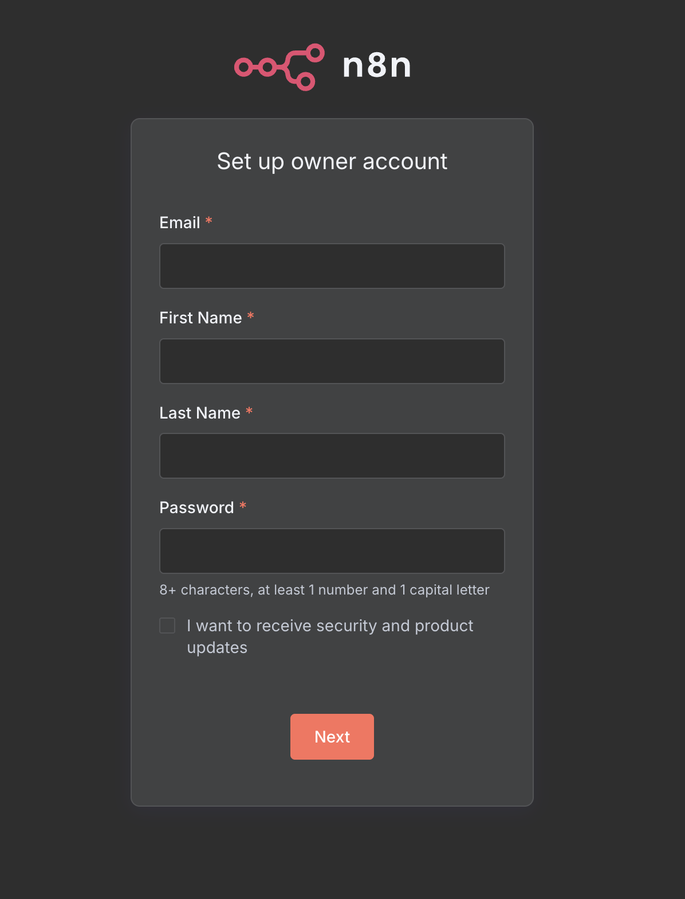
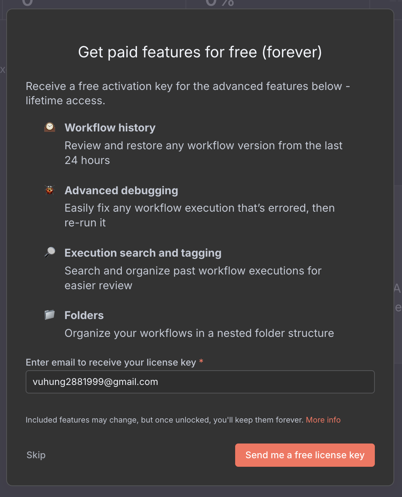
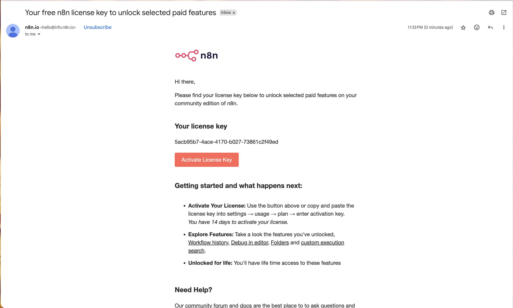

# Clone và Thiết lập N8N với Docker và VSCode

## Yêu Cầu Trước Khi Bắt Đầu

Đảm bảo bạn đã hoàn thành:

- [Cài đặt Docker Desktop](../01-setup/01-docker-desktop.vi.md)
- [Cài đặt VSCode](../02-vscode/01-install-vscode.vi.md)

## Các Bước Thiết Lập

### 1. Clone Repository

Clone repository này bằng một trong các phương pháp sau:

#### Tùy Chọn A: Tải Xuống Thủ Công

1. Đi đến [đây](https://github.com/HRLitgroup/n8n-posting-content-tutorial.git) và tìm nút có tên `Code`
2. Nhấp vào nút `Code` trong repository
3. Nhấp `Download ZIP`
4. Giải nén tệp ZIP đến vị trí mong muốn



#### Tùy Chọn B: Git Clone

```shell
git clone https://github.com/HRLitgroup/n8n-posting-content-tutorial.git
```

### 2. Mở Dự Án Trong VSCode

1. Mở VSCode
2. Đi đến `File` → `Open Folder`
3. Chọn thư mục `n8n-tutorial`

### 3. Khởi Động Máy Chủ N8N

1. Trong VSCode, mở terminal bằng phím tắt `Ctrl/Command + J`
2. Chạy các lệnh sau:

#### Khởi Động Máy Chủ N8N

```shell
docker-compose up -d
```

#### Dừng/Xóa Máy Chủ N8N (Tùy Chọn - Thực hiện lệnh này khi máy chủ N8N không còn cần thiết)

```shell
docker-compose down
```

### 4. Truy Cập N8N

1. Mở trình duyệt web
2. Điều hướng đến [http://localhost:5678](http://localhost:5678)
3. Đăng ký tài khoản N8N

### 5. Khắc Phục Sự Cố

Nếu bạn không thể truy cập liên kết ở bước 4:

1. Xóa thư mục `n8n_data`
2. Chạy lệnh `down` server
3. Lặp lại từ bước 3

### 6. Đăng Ký và Kích Hoạt Tài Khoản N8N

1. **Tạo Tài Khoản N8N**

   Làm theo trình hướng dẫn thiết lập N8N để tạo tài khoản:

   

   **Quan trọng**: Chọn tùy chọn `Send me a free license key` để tiếp tục với bước tiếp theo.

   

2. **Kích Hoạt Giấy Phép**

   Chờ một lúc để nhận email kích hoạt từ N8N, sau đó nhấp `Active License Key` để kích hoạt gói dùng thử miễn phí N8N.

   

3. **Hoàn Thành Thiết Lập**

   Sau khi tất cả cấu hình hoàn tất, bạn đã thành công tạo instance N8N tự host. Điều hướng đến [Trang Chủ](http://localhost:5678/home/workflows) và bạn đã sẵn sàng tạo quy trình!

## Bước Tiếp Theo

Sau khi N8N chạy thành công, tiếp tục với [Lấy Token Truy Cập](../04-authentication/get-access-token.vi.md).
