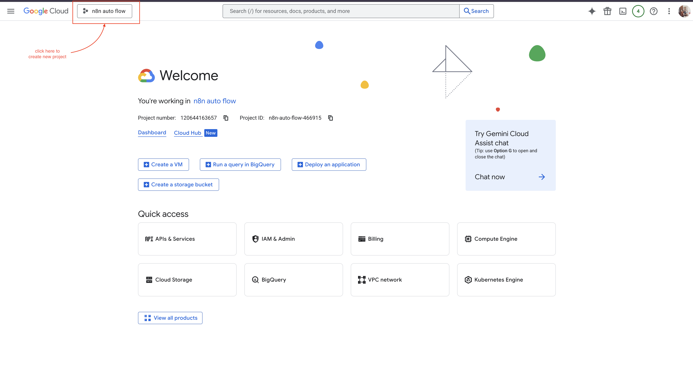
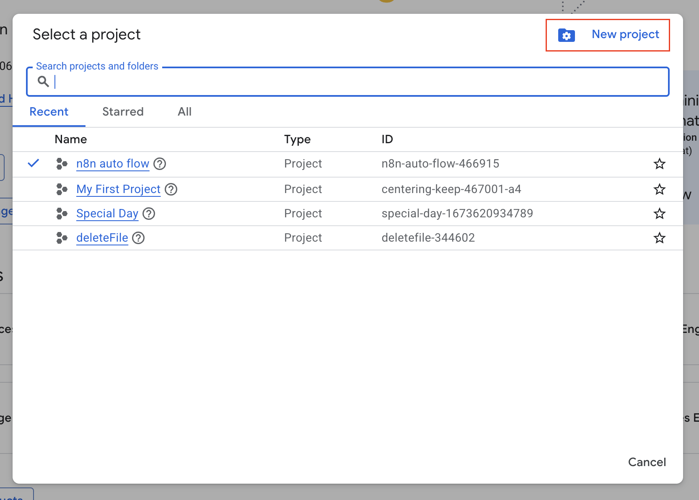
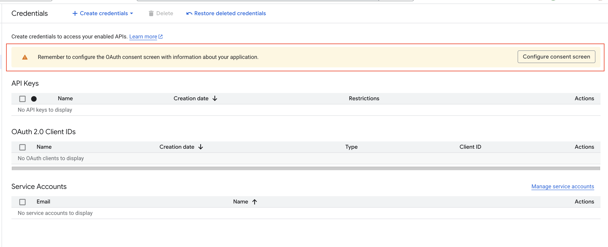
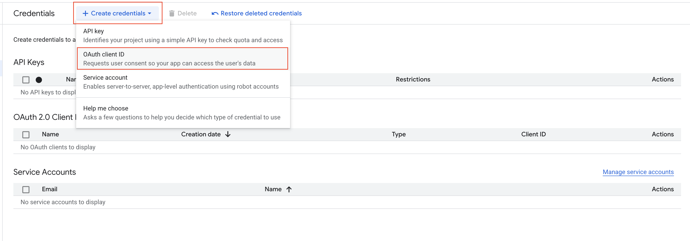
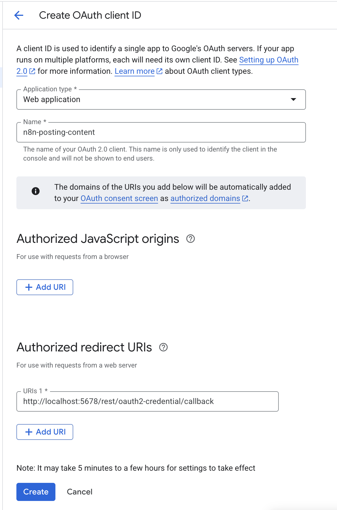

# Kết Nối Dịch Vụ Google với N8N

## 🎯 Chúng Ta Đang Thiết Lập Gì?

**Dịch Vụ Google** bao gồm Gmail, Google Sheets, Google Drive và Google Calendar. Bằng cách kết nối chúng với N8N, bạn có thể tự động hóa việc gửi email, cập nhật bảng tính, lưu tệp và quản lý sự kiện lịch.

### ✅ Bạn Sẽ Có Gì

- Khả năng gửi email tự động từ Gmail
- Cập nhật Google Sheets với dữ liệu mới
- Lưu tệp vào Google Drive tự động
- Quản lý sự kiện Google Calendar
- Tất cả dịch vụ Google hoạt động cùng nhau

## 🛠️ Bạn Cần Gì Trước Khi Bắt Đầu

Đảm bảo bạn có:

- ✅ Tài khoản Google (Gmail, Google Workspace, hoặc cá nhân)
- ✅ Khoảng 15-20 phút để hoàn thành thiết lập
- ✅ Mật khẩu Google sẵn sàng (bạn sẽ cần đăng nhập)

## 📋 Thiết Lập Từng Bước

### Bước 1: Tạo Dự Án Google Cloud

Hãy nghĩ về điều này như tạo một không gian làm việc cho tự động hóa:

1. **Mở trình duyệt web**
2. **Đi đến Google Cloud Console**: [Nhấp vào đây để truy cập](https://console.cloud.google.com/)
3. **Đăng nhập với tài khoản Google** nếu được nhắc
4. **Tìm dropdown dự án** ở đầu trang
5. **Nhấp "New Project"** hoặc nút "+"

6. **Nhập tên dự án** (ví dụ: "Tự Động Hóa N8N Của Tôi")
7. **Nhấp "Create"**

### Bước 2: Bật Các Dịch Vụ Bạn Cần

Bây giờ chúng ta sẽ bật các dịch vụ Google bạn muốn tự động hóa:

1. **Trong dự án mới**, tìm "APIs & Services" trong menu bên trái
2. **Nhấp "Library"**
3. **Tìm kiếm từng dịch vụ** bạn muốn sử dụng:

#### Cho Tự Động Hóa Email:

- Tìm kiếm "Gmail API"
- Nhấp vào nó và nhấn "Enable"

#### Cho Tự Động Hóa Bảng Tính:

- Tìm kiếm "Google Sheets API"
- Nhấp vào nó và nhấn "Enable"

#### Cho Quản Lý Tệp:

- Tìm kiếm "Google Drive API"
- Nhấp vào nó và nhấn "Enable"

### Bước 3: Thiết Lập Bảo Mật (Màn Hình Đồng Thuận OAuth)

Bước này cho Google biết rằng tự động hóa của bạn là an toàn:

1. **Đi đến "APIs & Services"** → **"OAuth consent screen"**
2. **Chọn "External"** (trừ khi bạn có tài khoản Google Workspace)
3. **Nhấp "Create"**
4. **Điền thông tin bắt buộc**:
   - **App name**: "Tự Động Hóa N8N Của Tôi"
   - **User support email**: Địa chỉ email của bạn
   - **Developer contact information**: Địa chỉ email của bạn
5. **Nhấp "Save and Continue"**
6. **Bỏ qua các phần tiếp theo** (Scopes, Test users) bây giờ
7. **Nhấp "Save and Continue"** cho đến khi hoàn tất

### Bước 4: Tạo Khóa Truy Cập

Điều này tạo ra các "chìa khóa" mà N8N sẽ sử dụng để truy cập dịch vụ Google:

1. **Đi đến "APIs & Services"** → **"Credentials"**
2. **Nhấp "Create Credentials"** → **"OAuth 2.0 Client IDs"**

3. **Điền biểu mẫu**:
   - **Application type**: Chọn "Web application"
   - **Name**: "Tích Hợp Google N8N"
   - **Authorized redirect URIs**: Thêm `http://localhost:5678/rest/oauth2-credential/callback`

4. **Nhấp "Create"**
5. **Một popup sẽ xuất hiện** với Client ID và Client Secret
6. **Nhấp "Download JSON"** để lưu các thông tin đăng nhập an toàn

### Bước 5: Thêm Bạn Làm Người Dùng Thử Nghiệm

Điều này cho phép tài khoản Google của bạn sử dụng tự động hóa:

1. **Quay lại "OAuth consent screen"**
2. **Nhấp "Add Users"** trong phần Test users
3. **Thêm địa chỉ email của bạn** (email bạn sử dụng cho Google)
4. **Nhấp "Save"**

## ✅ Cách Kiểm Tra Thiết Lập Có Hoạt Động Không

1. **Bạn nên đã tải xuống tệp JSON** với thông tin đăng nhập
2. **Email của bạn nên được liệt kê** trong phần Test users
3. **Các API nên hiển thị là "Enabled"** trong Library

## 🚨 Khắc Phục Sự Cố

### Không Tìm Thấy API?

- **Đảm bảo bạn ở đúng dự án** (kiểm tra tên dự án ở đầu)
- **Thử tìm kiếm lại** với tên chính xác: "Gmail API", "Google Sheets API"

### Vấn Đề Màn Hình Đồng Thuận OAuth?

- **Đảm bảo bạn điền tất cả trường bắt buộc** (đánh dấu \*)
- **Thử làm mới trang** và bắt đầu lại
- **Kiểm tra bạn chọn "External"** loại người dùng

### Thông Tin Đăng Nhập Không Hoạt Động?

- **Đảm bảo bạn đã tải xuống tệp JSON**
- **Kiểm tra email của bạn trong Test users**
- **Xác minh redirect URI chính xác**: `http://localhost:5678/rest/oauth2-credential/callback`

### Vẫn Có Vấn Đề?

- **Thử tạo dự án mới** và bắt đầu lại
- **Kiểm tra bạn đã đăng nhập** với tài khoản Google đúng
- **Đảm bảo bạn có quyền quản trị** cho tài khoản Google

## 🎉 Bạn Sẵn Sàng Cho Bước Tiếp Theo!

Sau khi thiết lập thông tin đăng nhập Google, bạn có thể:

1. **Kết nối LinkedIn**: [Thiết lập tự động hóa LinkedIn](./02-get-access-token-for-linkedin.vi.md)
2. **Kết nối Facebook**: [Thiết lập tự động hóa Facebook](./03-get-access-token-for-facebook.vi.md)
3. **Bắt đầu tạo quy trình**: Sử dụng dịch vụ Google trong N8N

## 📚 Tài Nguyên Bổ Sung

- **Cần giúp đỡ?** Kiểm tra [Tài liệu OAuth của Google](https://developers.google.com/identity/protocols/oauth2)
- **Muốn khám phá?** Thử [Google APIs Explorer](https://developers.google.com/apis-explorer/)
- **Trợ giúp N8N**: [Hướng dẫn tích hợp Google N8N](https://docs.n8n.io/integrations/nodes/n8n-nodes-base.google/)

---

_💡 **Mẹo**: Giữ tệp JSON đã tải xuống an toàn. Bạn sẽ cần nó khi kết nối với N8N sau này._
