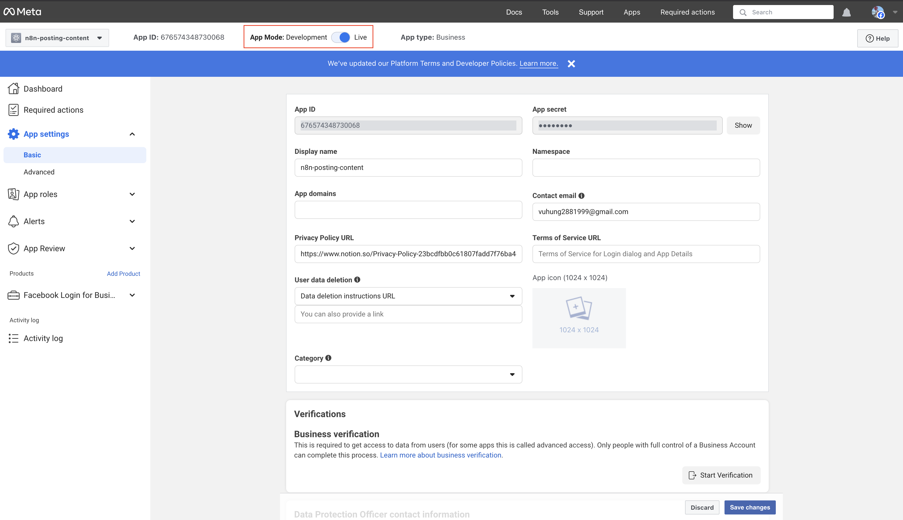
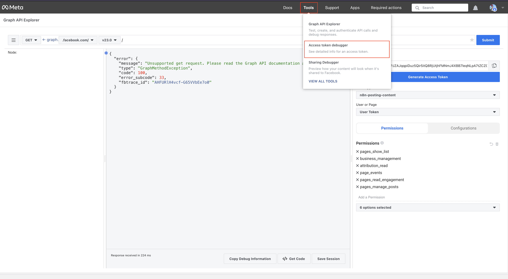

# Kết Nối Facebook với N8N

## 🎯 Chúng Ta Đang Thiết Lập Gì?

**Facebook** là nền tảng mạng xã hội lớn nhất thế giới. Bằng cách kết nối nó với N8N, bạn có thể tự động hóa việc đăng lên trang Facebook, chia sẻ nội dung và quản lý sự hiện diện mạng xã hội của mình.

### ✅ Bạn Sẽ Có Gì

- Tự động đăng nội dung lên trang Facebook
- Chia sẻ nội dung trên nhiều trang
- Quản lý nội dung trang kinh doanh
- Theo dõi hiệu suất mạng xã hội
- Tiết kiệm thời gian quản lý mạng xã hội

## 🛠️ Bạn Cần Gì Trước Khi Bắt Đầu

Đảm bảo bạn có:

- ✅ Tài khoản Facebook
- ✅ Trang Facebook Kinh Doanh (khuyến nghị cho sử dụng kinh doanh)
- ✅ Khoảng 10-15 phút để hoàn thành thiết lập
- ✅ Mật khẩu Facebook sẵn sàng

## 📋 Thiết Lập Từng Bước

### Bước 1: Tạo Ứng Dụng Facebook

Hãy nghĩ về điều này như tạo một "cầu nối" giữa Facebook và N8N:

1. **Mở trình duyệt web**
2. **Đi đến Facebook Developers**: [Nhấp vào đây để truy cập](https://developers.facebook.com/apps/)
3. **Đăng nhập với tài khoản Facebook** nếu được nhắc
4. **Nhấp "Create App"** (thường là nút màu xanh)

### Bước 2: Chọn Loại Ứng Dụng

1. **Trong phần "Add use cases"**, bạn sẽ thấy các tùy chọn khác nhau
2. **Chọn "Other"** → **"Business"**
3. **Nhấp "Create App"**
4. **Sau khi tạo ứng dụng**, tìm sản phẩm tên `Facebook Login for Business`
5. **Nhấp "Set up"** bên cạnh nó

### Bước 3: Cấu Hình Cài Đặt Ứng Dụng

Bước này thiết lập thông tin cơ bản cho ứng dụng:

1. **Trong bảng điều khiển ứng dụng**, đi đến "App Settings" → "Basic"
2. **Ghi chép những số quan trọng này**:

   - **App ID**: Một chuỗi dài số
   - **App Secret**: Một chuỗi dài khác (giữ bí mật!)

3. **Tìm "Privacy Policy URL"** và nhập:

   - Bạn có thể sử dụng URL này: `https://www.notion.so/Privacy-Policy-23bcdfbb0c61807fadd7f76ba4ef59fe`
   - Hoặc tạo của riêng bạn bằng [Notion](https://www.notion.so)

4. **Nhấp "Save Changes"**

### Bước 4: Làm Ứng Dụng Hoạt Động

Bước này cho phép ứng dụng hoạt động đúng cách:

1. **Tìm nút toggle** nói "Live" hoặc "Development"
2. **Nhấp toggle** để chuyển sang chế độ "Live"

### Bước 5: Tạo Token Truy Cập

Điều này tạo ra "chìa khóa" mà N8N sẽ sử dụng để truy cập Facebook:

1. **Từ thanh menu**, nhấp "Tools" → "Graph API Explorer"

2. **Trong "Meta App"**, chọn ứng dụng từ dropdown
3. **Trong "User or Page"**, chọn "Get Page Access Token"
4. **Bạn sẽ cần đăng nhập** với tài khoản Facebook
5. **Chọn trang** bạn muốn truy cập

6. **Nhấp "Save"**

### Bước 6: Thêm Quyền

Điều này cho Facebook biết tự động hóa có thể làm gì:

1. **Tìm phần "Permissions"**
2. **Thêm các quyền này** từng cái một:

   - `pages_show_list`
   - `business_management`
   - `attribution_read`
   - `page_events`
   - `pages_read_engagement`
   - `pages_manage_posts`

3. **Nhấp "Generate Access Token"**
4. **Nhấp "Copy"** để sao chép token truy cập

### Bước 7: Mở Rộng Token (Làm Cho Nó Tồn Tại Lâu Hơn)

Token Facebook hết hạn nhanh, vì vậy chúng ta cần mở rộng chúng:

1. **Từ "Tools"**, chọn "Access Token Debugger"

2. **Dán token** bạn đã sao chép trước đó
3. **Nhấp "Debug"**
4. **Cuộn xuống cuối** và bạn sẽ thấy "Extend Access Token"
5. **Nhấp "Extend Access Token"**
6. **Sao chép token mới** (nó sẽ có màu xanh) - cái này tồn tại lâu hơn

## ✅ Cách Kiểm Tra Thiết Lập Có Hoạt Động Không

1. **Bạn nên có App ID và App Secret** ghi chép
2. **Ứng dụng nên ở chế độ "Live"**
3. **Bạn nên đã tạo token truy cập**
4. **Bạn nên đã mở rộng token** (cái màu xanh)

## 🚨 Khắc Phục Sự Cố

### Không Tìm Thấy Nút Create App?

- **Đảm bảo bạn đã đăng nhập** vào tài khoản Facebook đúng
- **Thử làm mới trang**
- **Kiểm tra bạn ở trang developers**: developers.facebook.com/apps

### Tạo Ứng Dụng Thất Bại?

- **Thử tên ứng dụng khác** (có thể đã được sử dụng)
- **Đảm bảo bạn chọn "Other" → "Business"**
- **Kiểm tra bạn sử dụng tài khoản Facebook đúng**

### Không Thể Tạo Token Truy Cập?

- **Đảm bảo bạn đã đăng nhập** vào Facebook
- **Kiểm tra bạn chọn đúng trang**
- **Thử làm mới Graph API Explorer**

### Token Không Hoạt Động?

- **Đảm bảo bạn đã mở rộng token** (cái màu xanh)
- **Kiểm tra bạn sao chép toàn bộ token**
- **Thử tạo token mới** nếu cái cũ hết hạn

### Vẫn Có Vấn Đề?

- **Thử tạo ứng dụng mới** với tên khác
- **Kiểm tra bạn sử dụng tài khoản Facebook đúng**
- **Đảm bảo bạn có quyền quản trị** cho trang Facebook

## 🎉 Bạn Sẵn Sàng Cho Bước Tiếp Theo!

Sau khi thiết lập thông tin đăng nhập Facebook, bạn có thể:

1. **Kết nối Google**: [Thiết lập tự động hóa Google](./01-get-access-token-for-google.vi.md)
2. **Kết nối LinkedIn**: [Thiết lập tự động hóa LinkedIn](./02-get-access-token-for-linkedin.vi.md)
3. **Bắt đầu tạo quy trình**: Sử dụng Facebook trong tự động hóa N8N

## 📚 Tài Nguyên Bổ Sung

- **Cần giúp đỡ?** Kiểm tra [Tài liệu Facebook Graph API](https://developers.facebook.com/docs/graph-api)
- **Muốn tìm hiểu thêm?** Thử [Hướng dẫn OAuth Facebook](https://developers.facebook.com/docs/facebook-login/security)
- **Trợ giúp N8N**: [Tích hợp Facebook N8N](https://docs.n8n.io/integrations/nodes/n8n-nodes-base.facebook/)
- **Kiểm tra thiết lập**: [Graph API Explorer](https://developers.facebook.com/tools/explorer/)

---

_💡 **Mẹo**: Giữ App ID, App Secret và token truy cập mở rộng an toàn. Bạn sẽ cần chúng khi kết nối với N8N sau này._
