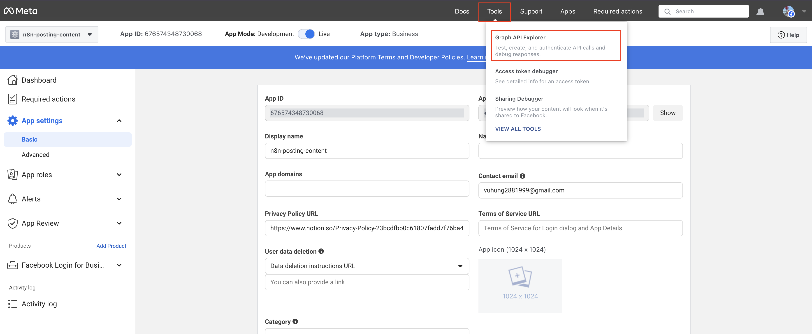

# Lấy Token Truy Cập Facebook API cho N8N

## Tổng Quan

Hướng dẫn này cung cấp hướng dẫn từng bước để lấy token truy cập Facebook API có thể được sử dụng trong quy trình N8N cho marketing Facebook, tự động hóa mạng xã hội và quản lý trang doanh nghiệp.

## Yêu Cầu Trước Khi Bắt Đầu

Trước khi bắt đầu, đảm bảo bạn có:

- Tài khoản Facebook
- Trang Doanh Nghiệp Facebook
- Hiểu biết cơ bản về khái niệm xác thực API

## Bước 1: Tạo Ứng Dụng Facebook

1. Đi đến [Facebook Developers Apps](https://developers.facebook.com/apps/)
2. Nhấp "Create App"
3. Trong `Add use cases`, chọn loại ứng dụng **Other** → **Business**
4. Nhấp "Create App"
5. Sau khi tạo ứng dụng, trong dashboard của ứng dụng, tìm và thiết lập sản phẩm có tên `Facebook Login for Business`, sau đó nhấp `Set up`

## Bước 2: Cấu Hình Cài Đặt Ứng Dụng

1. Trong dashboard ứng dụng, đi đến "App Settings" → "Basic"
2. Ghi chú thông tin xác thực của bạn:
   - **App ID**: Định danh duy nhất của ứng dụng
   - **App Secret**: Khóa bí mật của ứng dụng (giữ an toàn)
3. Nhập trường "Privacy Policy URL":
   - Bạn có thể đơn giản sử dụng URL này: `https://www.notion.so/Privacy-Policy-23bcdfbb0c61807fadd7f76ba4ef59fe`
   - Hoặc bạn có thể tạo một cái mới bằng cách sử dụng [Notion](https://www.notion.so) để tạo tài liệu mới với nội dung giống như URL trên. Sau đó đặt quyền là `Anyone via link`.
4. Nhấp "Save Changes"

## Bước 3: Đặt chế độ ứng dụng thành `Live`

- Nhấp nút toggle trong hình
  

## Bước 4: Tạo Token Truy Cập

1. Từ thanh menu, nhấp "Tool" → "Graph API Explorer"
   
2. Trong "Meta App", chọn ứng dụng của bạn.
3. Trong "User or Page", chọn "Get Page Access Token"

- Bạn cần đăng nhập bằng tài khoản Facebook, sau đó chọn trang bạn muốn truy cập như thế này:
  
- Sau đó nhấp "Save"

4. Thêm "Permissions" cho token truy cập theo hướng dẫn này:

```
pages_show_list
business_management
attribution_read
page_events
pages_read_engagement
pages_manage_posts
```

5. Nhấp "Generate Access Token", sau đó nhấp nút "Copy" để sao chép token truy cập của bạn
   

## Bước 5: Mở rộng thời hạn token truy cập lâu hơn

1. Từ "Tool" → Chọn "Access token debugger"
   
2. Dán token bạn đã sao chép vào trường nhập liệu, sau đó nhấp nút "Debug"
3. Cuộn xuống cuối và bạn sẽ thấy nút "Extend Access Token", nhấp vào nó.
4. Bạn sẽ nhận được token truy cập mới với màu xanh lá, sao chép và lưu để sử dụng sau này

## Bước Tiếp Theo

Tiếp tục với [Quy Trình N8N](../05-workflows/01-create-n8n-workflow.vi.md).

## Tài Nguyên Bổ Sung

- [Tài Liệu Facebook Graph API](https://developers.facebook.com/docs/graph-api)
- [Hướng Dẫn Facebook OAuth 2.0](https://developers.facebook.com/docs/facebook-login/security)
- [Tích Hợp Facebook N8N](https://docs.n8n.io/integrations/nodes/n8n-nodes-base.facebook/)
- [Facebook Developers Portal](https://developers.facebook.com/)
- [Graph API Explorer](https://developers.facebook.com/tools/explorer/)
