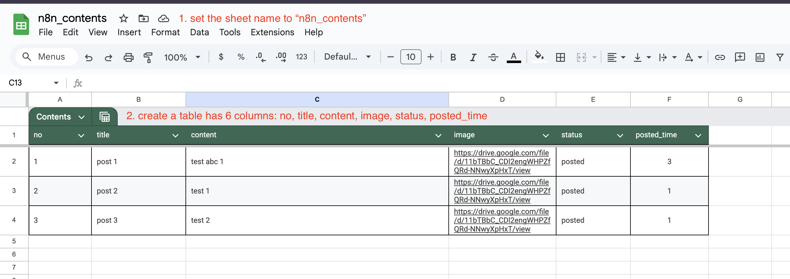
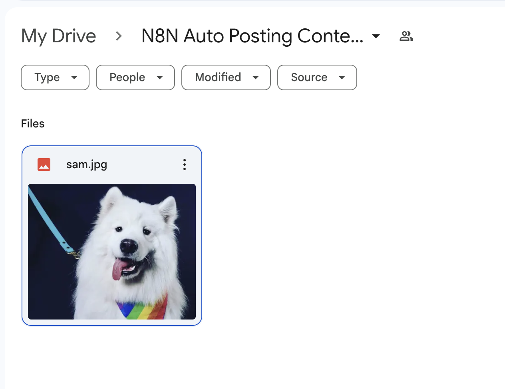
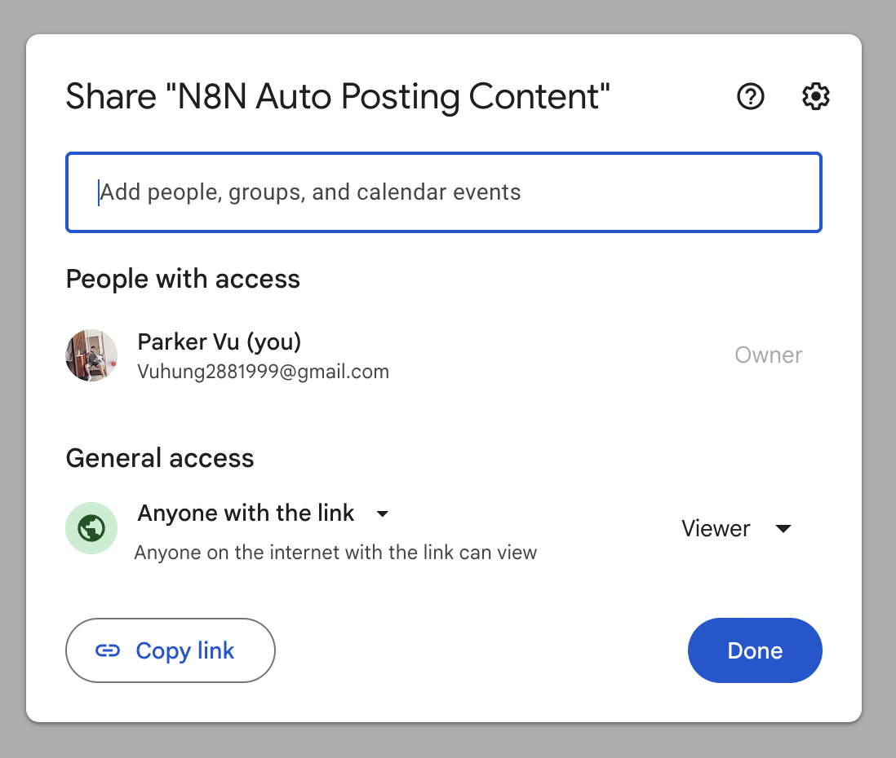

# Tạo Google Sheet để Lưu Trữ Nội Dung

## Trước Khi Bắt Đầu

Bạn có thể xem [sheet demo của tôi](https://docs.google.com/spreadsheets/d/1kZKFQHKA0mLgP5-wGmY56QeT5h9ykyDjNB7hRpOm35U) làm tham khảo.

## Cấu Trúc Bảng Google Sheet

Tạo một bảng với 6 cột sau:

| Cột             | Mô Tả                                                      | Giá Trị Mặc Định | Ghi Chú                                                          |
| --------------- | ---------------------------------------------------------- | ---------------- | ---------------------------------------------------------------- |
| **no**          | Số thứ tự cho mỗi mục nội dung                             | -                | Định danh duy nhất                                               |
| **title**       | Tiêu đề của nội dung                                       | -                | Tùy chọn - có thể được sử dụng cho các tính năng trong tương lai |
| **content**     | Nội dung thực tế sẽ được đăng lên các nền tảng mạng xã hội | -                | Trường nội dung chính                                            |
| **image**       | URL của hình ảnh từ Google Drive                           | -                | Xem tài liệu hình ảnh bên dưới                                   |
| **status**      | Trạng thái nội dung                                        | `draft`          | Các giá trị có thể: `draft`, `ready`, `posted`                   |
| **posted_time** | Số lần nội dung đã được đăng                               | `0`              | Theo dõi tần suất đăng                                           |

### Các Giá Trị Trạng Thái

- `draft`: Nội dung vẫn đang trong quá trình thực hiện
- `ready`: Nội dung đã sẵn sàng để được xử lý bởi n8n
- `posted`: Nội dung đã được đăng thành công lên mạng xã hội

## Thiết Lập Thư Mục Google Drive cho Hình Ảnh

### Bước 1: Tạo Thư Mục

Trong Google Drive của bạn, tạo một thư mục có tên 'N8N Auto Posting Content'

### Bước 2: Cấp Quyền

Đặt quyền thư mục thành 'Bất kỳ ai có liên kết' - điều này cho phép n8n tải xuống hình ảnh dễ dàng hơn

---

**Trước**: [Tạo Quy Trình N8N](./n8n-workflow.vi.md)  
**Tiếp**: [Tạo Thông Tin Xác Thực](./02-create-credentials.vi.md)
