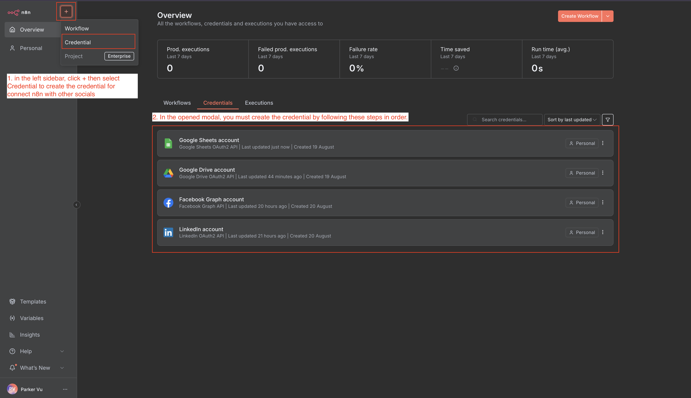
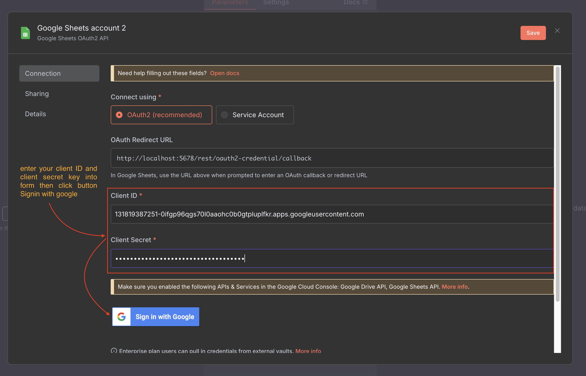
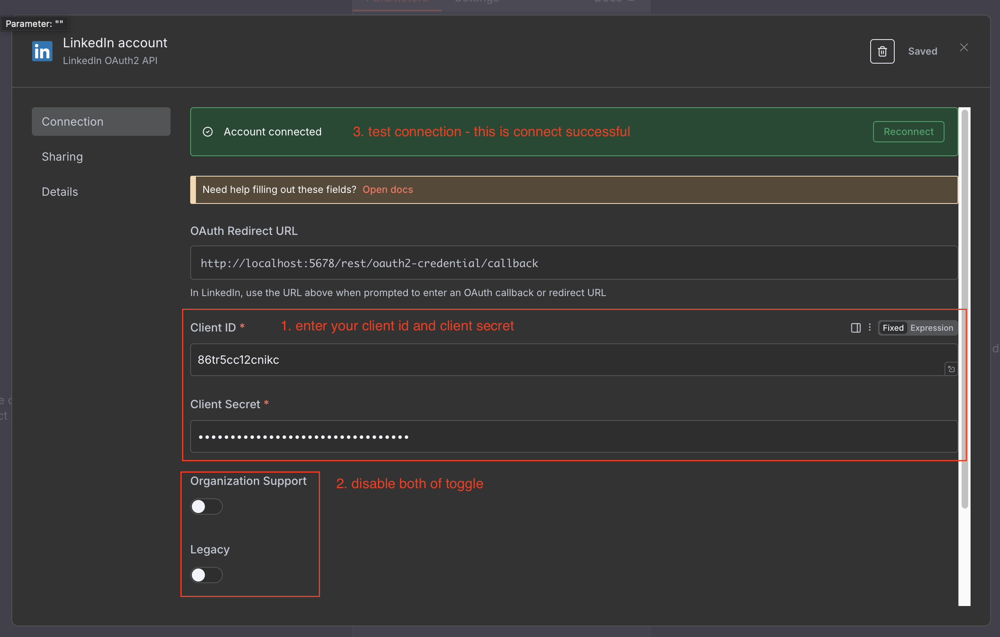

# Tạo Thông Tin Xác Thực để Kết Nối n8n với Các Nền Tảng Mạng Xã Hội

## Cách Tạo Thông Tin Xác Thực trong n8n

1. Trong thanh bên trái, nhấp vào nút **+**, sau đó chọn **Credential** - một modal sẽ xuất hiện
   

2. Bạn phải tạo thông tin xác thực theo thứ tự sau:

| Thứ Tự | Nền Tảng                 | Mục Đích                   |
| ------ | ------------------------ | -------------------------- |
| 1      | Tài khoản Google Sheets  | Truy cập dữ liệu bảng tính |
| 2      | Tài khoản Google Drive   | Truy cập tệp hình ảnh      |
| 3      | Tài khoản Facebook Graph | Đăng lên Facebook          |
| 4      | Tài khoản LinkedIn       | Đăng lên LinkedIn          |

## Tài Khoản Google Sheets và Tài Khoản Google Drive

Cả Google Sheets và Google Drive đều sử dụng cùng quy trình tạo thông tin xác thực. Hướng dẫn này minh họa thiết lập Google Sheets.

### Bước 1: Nhập Thông Tin Xác Thực

Điền **Client ID** và **Client Secret** của bạn, sau đó nhấp vào **Sign in with Google**

### Bước 2: Cấp Quyền

Trình duyệt sẽ chuyển hướng bạn đến cổng đăng nhập Google. Chọn tài khoản Google của bạn, sau đó bạn sẽ được chuyển hướng đến trang quyền. Nhấp vào **Select All** để cấp tất cả quyền truy cập Google Sheets và Google Drive, sau đó nhấp vào **Continue**

### Bước 3: Xử Lý Cảnh Báo

Bạn có thể thấy thông báo cảnh báo - đừng lo lắng, chỉ cần nhấp vào **Continue**

### Bước 4: Xác Minh Hoàn Tất

Sau khi xác minh, bạn sẽ thấy thông báo thành công màu xanh lá như thế này. (Lặp lại cùng quy trình cho Google Drive)

## Tài Khoản Facebook Graph

## Tài Khoản LinkedIn

---

**Trước**: [Tạo Sheet](./01-create-sheet.vi.md)  
**Tiếp**: [Tạo Quy Trình](./03-create-workflow.vi.md)
