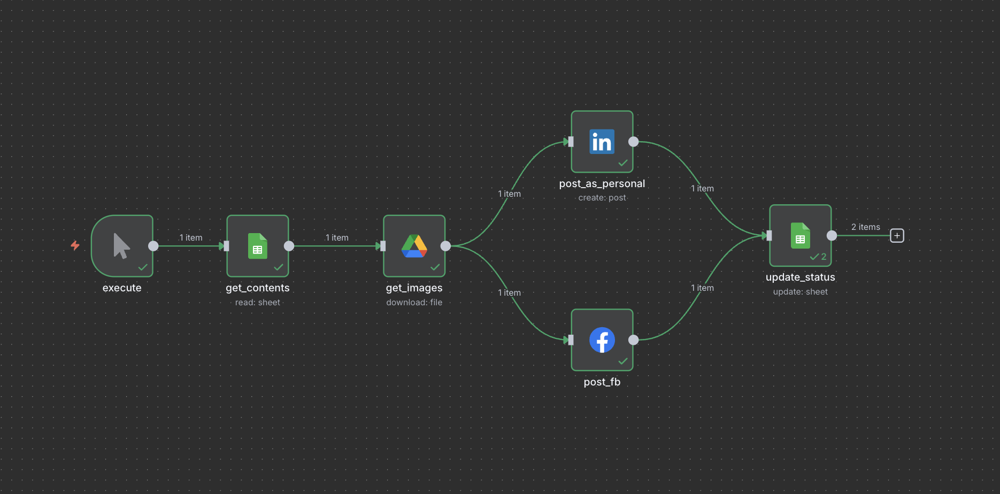
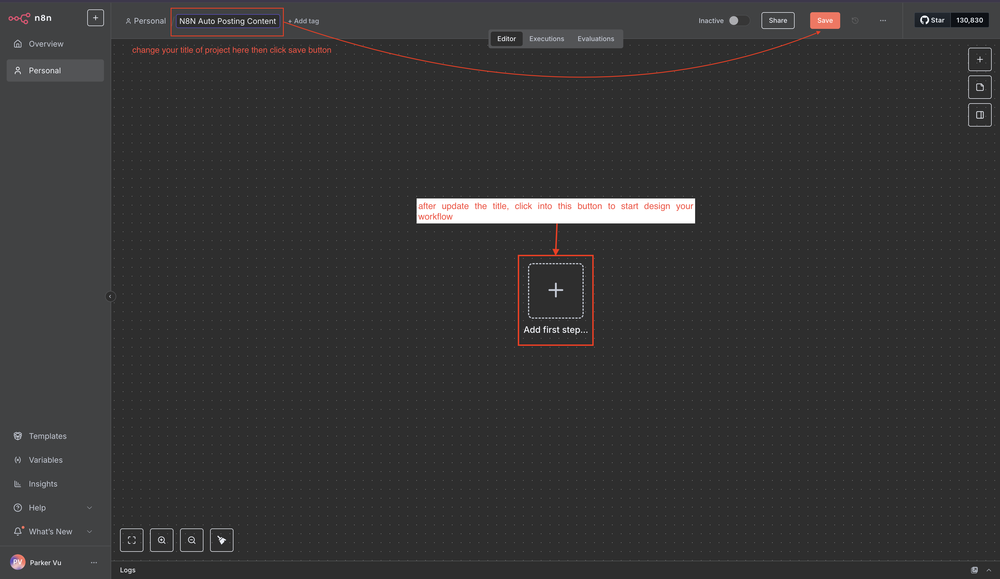
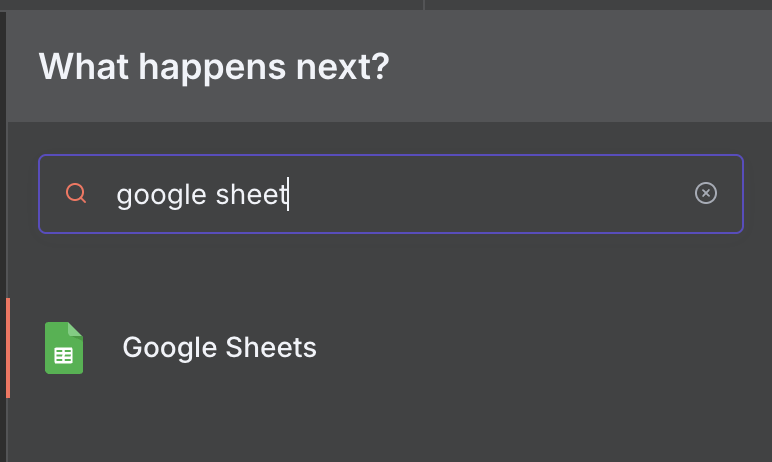
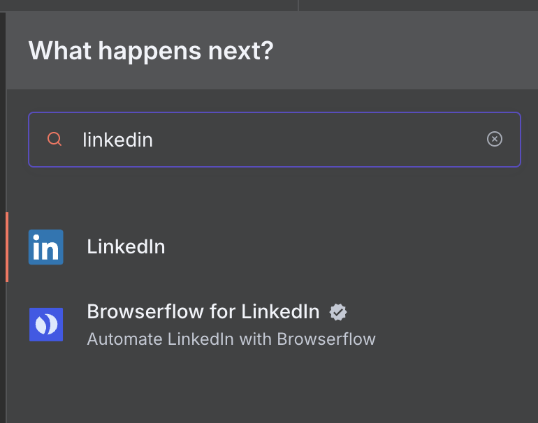
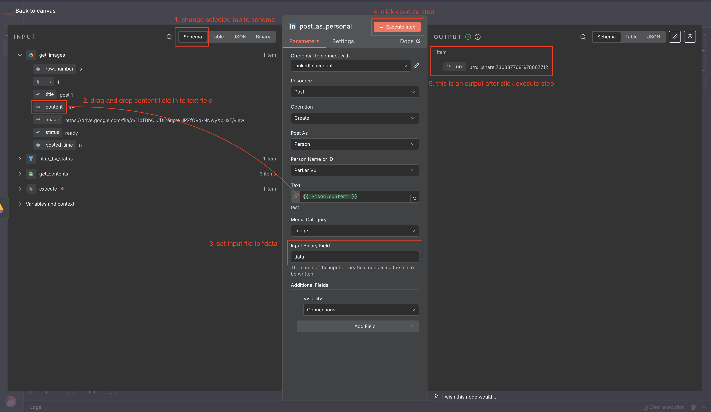
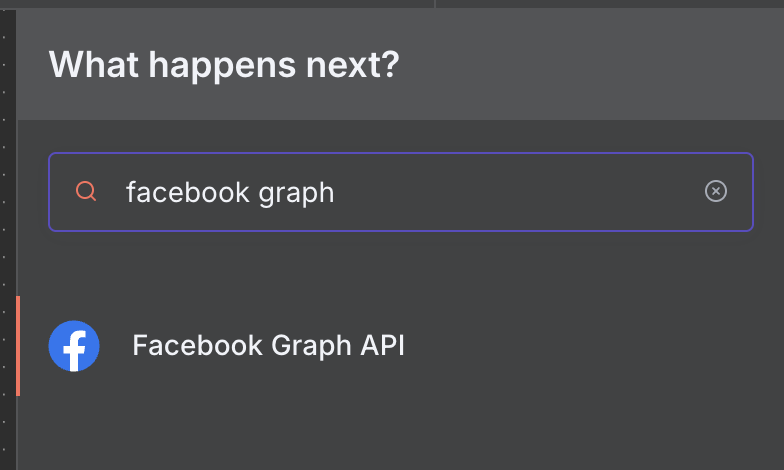

# Tạo Quy Trình cho n8n

## Tổng Quan

Trước khi bắt đầu, hãy xem tổng quan quy trình để hiểu cấu trúc và hình dạng của nó.

**Lưu ý**: Nếu bạn muốn bắt đầu nhanh chóng, bạn có thể tái sử dụng [quy trình của tôi](../../../exports/N8N%20Auto%20Posting%20Content.json)

- Tải xuống tệp JSON và nhập vào n8n
- Cập nhật thông tin xác thực với thông tin tài khoản của bạn (làm theo [tài liệu trước](../05-workflows/02-create-credentials.vi.md))
- Thế là xong! Quy trình tự động đăng nội dung n8n của bạn đã sẵn sàng thực thi.

## Tổng Quan Các Bước Quy Trình

| Bước | Hành Động                 | Mục Đích                                        | Nền Tảng           |
| ---- | ------------------------- | ----------------------------------------------- | ------------------ |
| 1    | Tạo Quy Trình             | Khởi tạo dự án quy trình mới                    | n8n                |
| 2    | Kích Hoạt Thủ Công        | Bắt đầu thực thi quy trình                      | n8n                |
| 3    | Lấy Dữ Liệu Google Sheets | Lấy nội dung có trạng thái 'ready'              | Google Sheets      |
| 4    | Tải Xuống Hình Ảnh        | Chuyển đổi URL hình ảnh sang định dạng nhị phân | Google Drive       |
| 5    | Đăng Lên LinkedIn         | Chia sẻ nội dung trên LinkedIn                  | LinkedIn           |
| 6    | Đăng Lên Facebook         | Chia sẻ nội dung trên Facebook                  | Facebook Graph API |
| 7    | Cập Nhật Trạng Thái Sheet | Đánh dấu nội dung đã đăng và tăng bộ đếm        | Google Sheets      |

## Bước 1

Trên trang chủ, nhấp vào 'Create Workflow'.

Tiếp theo, đặt tên dự án thành 'N8N Auto Posting Content' và nhấp Save.

Sau đó, nhấp vào nút 'Add first step...'.

## Bước 2

Chúng ta sẽ sử dụng node Manual trigger, có nghĩa là n8n sẽ chạy quy trình khi chúng ta nhấp vào 'Execute Workflow'.

## Bước 3

Nhấp vào nút +, tìm kiếm 'Google Sheets', và chọn nó.

Chúng ta sẽ sử dụng hành động 'Get row(s) in sheet' để lấy tất cả nội dung có trạng thái 'ready'.

Làm theo hướng dẫn bên dưới (nhớ kết nối node này với node trigger từ Bước 2):

1. Chọn kết nối thông tin xác thực Google Sheets của bạn
2. Chọn tài liệu của bạn (n8n_contents) và chỉ mục sheet (Sheet1)
3. Thêm bộ lọc để lấy bản ghi có trạng thái 'ready':
   - Chọn cột: status
   - Đặt giá trị thành: 'ready'
4. Nhấp vào 'Execute Step'
5. Kết quả thành công hoặc thất bại sẽ xuất hiện ở bên phải
   

## Bước 4

Nhấp vào nút +, tìm kiếm 'Google Drive', và chọn nó.

Chúng ta sẽ sử dụng hành động 'Download file' để chuyển đổi hình ảnh từ URL sang định dạng nhị phân, vì các nền tảng mạng xã hội chỉ chấp nhận hình ảnh ở định dạng nhị phân.

Làm theo hướng dẫn bên dưới (nhớ kết nối node này với node Google Sheets từ Bước 3):

1. Chọn kết nối thông tin xác thực Google Drive của bạn
2. Trong trường File, thay đổi dropdown bên trái thành 'By URL'
3. Kéo và thả trường 'image' vào trường giá trị File bên phải (xem hình để biết chi tiết)
4. Nhấp vào 'Execute Step'
5. Kết quả thành công hoặc thất bại sẽ xuất hiện ở bên phải
   

## Bước 5

Nhấp vào nút +, tìm kiếm 'LinkedIn', và chọn nó.

Chọn hành động 'Create a post'.

Làm theo hướng dẫn bên dưới (nhớ kết nối node này với node Google Drive từ Bước 4):

1. Chọn kết nối thông tin xác thực 'LinkedIn account' của bạn
2. Từ góc trên bên trái, thay đổi tab hiện tại thành 'Schema'
3. Kéo và thả trường 'content' vào trường giá trị Text ở giữa (xem hình để biết chi tiết)
4. Trong 'Input Binary Field', nhập giá trị: 'data'
5. Nhấp vào 'Execute Step'
6. Kết quả thành công hoặc thất bại sẽ xuất hiện ở bên phải
   

## Bước 6

Nhấp vào nút +, tìm kiếm 'Facebook Graph API', và chọn nó.

Làm theo hướng dẫn bên dưới (nhớ kết nối node này với node Google Drive từ Bước 4):

1. Chọn kết nối thông tin xác thực 'Facebook Graph account' của bạn
2. Từ góc trên bên trái, thay đổi tab hiện tại thành 'Schema'
3. Cấu hình các trường:
   - HTTP Request Method: POST (được sử dụng để tạo yêu cầu đăng tin nhắn mới lên Facebook API)
   - Graph API Version: Chọn phiên bản mới nhất (hiện tại là v23.0)
   - Node: me
   - Edge: photos (được sử dụng để đăng tin nhắn mới với hình ảnh)
4. Bật 'Send Binary File' và đặt Input Binary Field thành 'data'
5. Trong Options, tạo một Query Parameter mới với:
   - Name: message
   - Value: Kéo và thả trường 'content' vào trường Value (xem hình để biết chi tiết)
6. Nhấp vào 'Execute Step'
7. Kết quả thành công hoặc thất bại sẽ xuất hiện ở bên phải
   

## Bước 7

Nhấp vào nút +, tìm kiếm 'Google Sheets', và chọn nó.
Chúng ta sẽ sử dụng hành động 'Update row in sheet' để cập nhật trạng thái thành 'posted' và tăng posted_time lên 1.

Làm theo hướng dẫn bên dưới (nhớ kết nối node này với cả node LinkedIn và Facebook từ Bước 5 & 6):

1. Chọn kết nối thông tin xác thực 'Google Sheets account' của bạn
2. Cấu hình các trường:
   - Resource: Sheet Within Document
   - Operation: Update Row
   - Document and Sheet: Chọn tài liệu của bạn (n8n_contents) và chỉ mục sheet (Sheet1)
   - Mapping Column Mode: Map Each Column Manually
   - Column to match on: Chọn trường 'no'
3. Trong trường 'Value to Update':
   - Kéo và thả trường 'no' vào trường **no (using to match)**
     
   - Trong trường status, đặt giá trị thành 'posted'
   - Trong trường posted_time, kéo và thả 'posted_time' vào giá trị của posted_time ở giữa (xem hình để biết chi tiết), sau đó thêm `+ 1` trước cuối `}}`
     
4. Nhấp vào 'Execute Step'
5. Kết quả thành công hoặc thất bại sẽ xuất hiện ở bên phải

---

**Trước**: [Tạo Thông Tin Xác Thực](./02-create-credentials.vi.md)  
**Tiếp**: [Quay Lại Tổng Quan Quy Trình](./n8n-workflow.vi.md)
